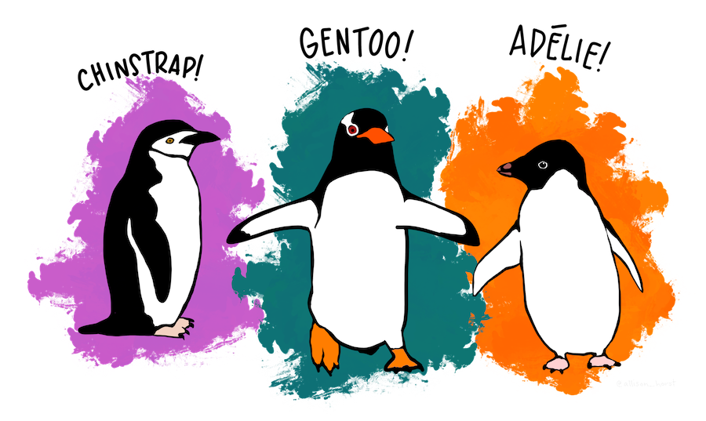

```{r meta, echo=FALSE, eval=FALSE}
library(metathis)
meta() %>%
  meta_social(
    title = "Antarctic Tour of the Tidyverse | Silvia Canelón",
    description = "An R tutorial to learn how to explore and manipulate data with packages from the Tidyverse",
    url = "https://slides.silviacanelon.com/tour-of-the-tidyverse",
    image = "https://slides.silviacanelon.com/tour-of-the-tidyverse/images/title-slide.png",
    image_alt = "",
    twitter_card_type = "summary_large_image",
    twitter_creator = "@spcanelon"
  )
```

```{r setup, include=FALSE}
options(htmltools.dir.version = FALSE)
knitr::opts_chunk$set(collapse = TRUE,
                      fig.retina = 3,
                      warning = FALSE,
                      message = FALSE)

library(tidyverse)
library(palmerpenguins)
library(nord)
library(prismatic)
library(xaringanExtra)
xaringanExtra::use_xaringan_extra(include = c("panelset", "tile_view", "share_again"))
xaringanExtra::use_clipboard()
xaringanExtra::style_share_again(share_buttons = c("twitter", "linkedin", "pocket"))
xaringanExtra::embed_xaringan(
  url = "https://spcanelon.github.io/tour-of-the-tidyverse", ratio = "16:9")
```
class: title-slide, center, bottom


```{r title-slide, echo=FALSE, out.width=400}

```
# `r rmarkdown::metadata$title`

## `r rmarkdown::metadata$subtitle`

### `r rmarkdown::metadata$author` &#8226; `r rmarkdown::metadata$date`

### `r fontawesome::fa("github", a11y = "sem")` repo: [spcanelon/tour-of-the-tidyverse](https://github.com/spcanelon/tour-of-the-tidyverse)


---
class: about-me, middle, center

## Silvia Canelón 

### Postdoctoral Research Scientist

### University of Pennsylvania, Philadelphia, PA, USA


[`r fontawesome::fa("link", a11y = "sem")` silviacanelon.com](https://www.silviacanelon.com)<br/>
[`r fontawesome::fa("twitter", a11y = "sem")` @spcanelon](https://twitter.com/spcanelon)<br/>
[`r fontawesome::fa("github", a11y = "sem")` @spcanelon](https://github.com/spcanelon)  

.footnote[<span>Photo by <a href="https://unsplash.com/@lukehuff?utm_source=unsplash&amp;utm_medium=referral&amp;utm_content=creditCopyText">lucas huffman</a> on <a href="https://unsplash.com/s/photos/antarctica?utm_source=unsplash&amp;utm_medium=referral&amp;utm_content=creditCopyText">Unsplash</a></span>]

---
class: left, middle

# Acknowledgments

### [palmerpenguins](https://allisonhorst.github.io/palmerpenguins/articles/intro.html) `r emo::ji("package")` developed by Drs. [Allison Horst](https://www.allisonhorst.com/), [Alison Hill](https://alison.rbind.io/), and [Kristen Gorman](https://www.uaf.edu/cfos/people/faculty/detail/kristen-gorman.php).

### Penguin artwork by Allison Horst ([@allison_horst](https://twitter.com/allison_horst))

### Slide inspiration from Alison Hill ([@apreshill](https://twitter.com/apreshill))'s recent education training materials "[Teaching in Production](https://rstudio-education.github.io/teaching-in-production/)"

### Slides made using Dr. Yihui Xie's [xaringan](https://github.com/yihui/xaringan) `r emo::ji("package")` and Garrick Aden-Buie's [xaringanExtra](https://github.com/gadenbuie/xaringanExtra) `r emo::ji("package")`, and adapted from the [R-Ladies `xaringan` theme designed by Alison Hill](https://alison.rbind.io/post/2017-12-18-r-ladies-presentation-ninja/)

### Photographs from various photographers on Unsplash, and noted on the relevant slide

---
class: left, top
background-image: url(images/logo.png)
background-position: 1050px 50px
background-size: 80px

# Meet our penguin friends!

<div class="flex" style="margin: 0 0em;">
  <div class="column">
    <h3> Chinstrap </h3>
    
  </div>
  
  <div class="column" style="margin: 0 1em;">
    <h3> Gentoo </h3>
    
  </div>
  
  <div class="column" style="margin: 0 0em;">
    <h3> Adélie </h3>
    
  </div>
</div>

.footnote[`r emo::ji("penguin")`<span>Photos by <a href="https://unsplash.com/@longmaspirit?utm_source=unsplash&amp;utm_medium=referral&amp;utm_content=creditCopyText">Long Ma</a> on <a href="https://unsplash.com/collections/12240655/palmerpenguins/d5aed8c855e26061e5e651d3f180b76d?utm_source=unsplash&amp;utm_medium=referral&amp;utm_content=creditCopyText">Unsplash</a></span>
]

---
class: right, top
background-image: url(images/pptx/tidyverse.png)
background-size: 1150px

## Collection of R packages, including <br/> these 8 core packages (and more!)

---

```{r 01-readr, child="01-readr.Rmd"}
```

---

```{r 02-tibble, child="02-tibble.Rmd"}
```

---

```{r 03-ggplot2, child="03-ggplot2.Rmd"}
```

---

```{r 04-dplyr, child="04-dplyr.Rmd"}
```

---

```{r 05-forcats, child="05-forcats.Rmd"}
```

---

```{r 06-stringr, child="06-stringr.Rmd"}
```

---

```{r 07-tidyr, child="07-tidyr.Rmd"}
```

---

```{r 08-purrr, child="08-purrr.Rmd"}
```

---
class: about-me, middle, center

# Thank you! 

## Any questions?

