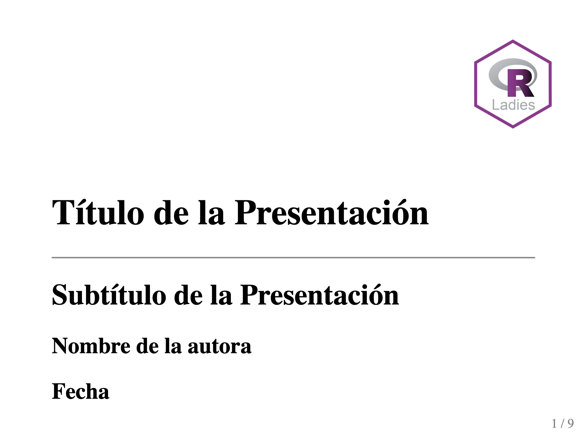
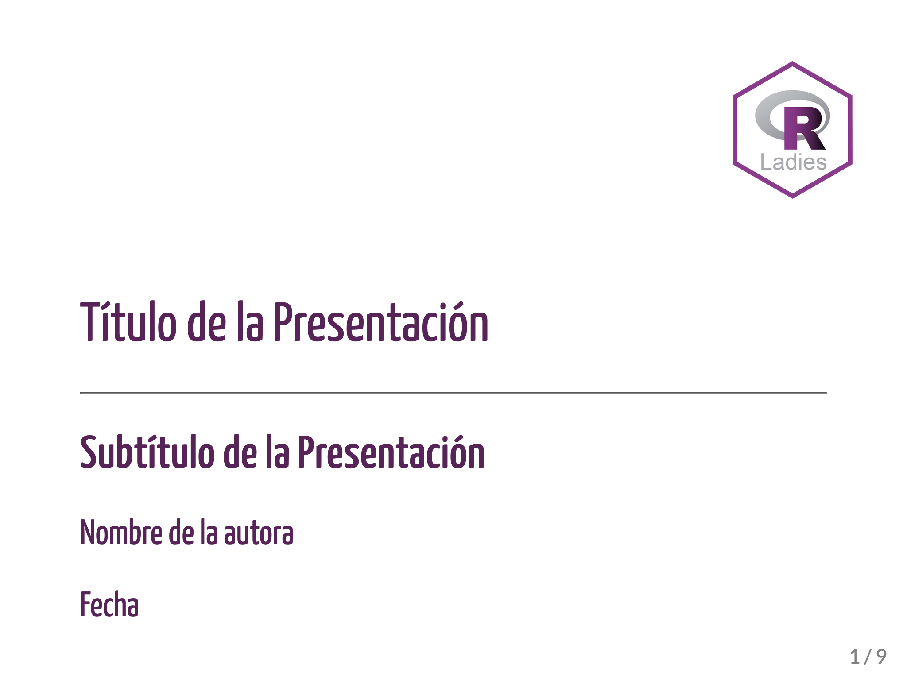
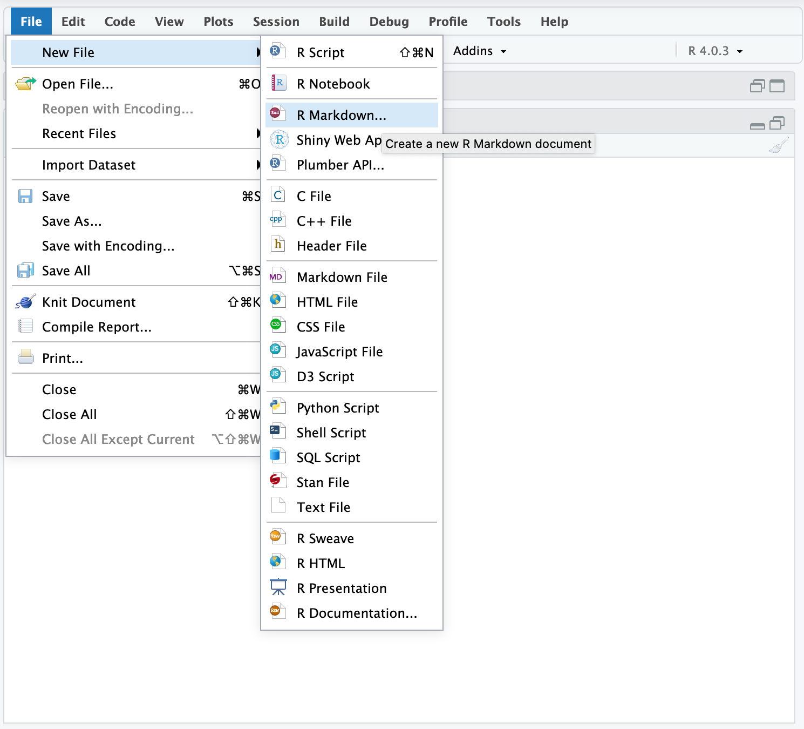
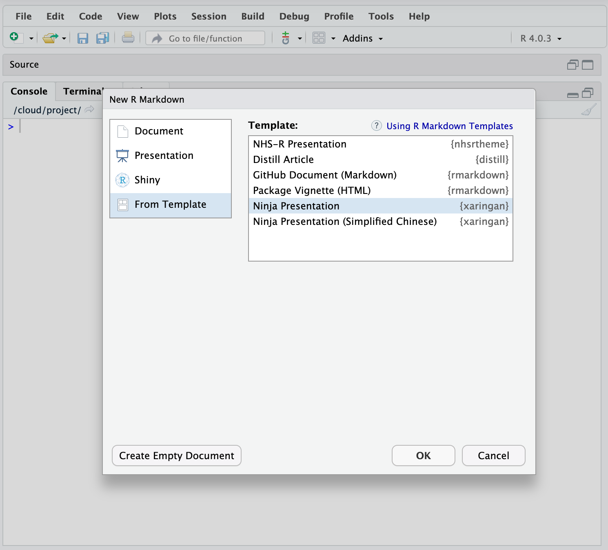

```{r meta, echo=FALSE, eval=FALSE}
library(metathis)
meta() %>%
  meta_general(
    description = "Tutorial de xaringan creado para R-Ladies Xalapa",
    generator = "xaringan and remark.js"
  ) %>% 
  meta_name("github-repo" = "spcanelon/xaringan-rladies-xalapa") %>% 
  meta_social(
    title = "Introducción al paquete xaringan",
    url = "https://spcanelon.github.io/xaringan-rladies-xalapa",
    image = "https://github.com/spcanelon/xaringan-rladies-xalapa/blob/master/xaringan-rladies-xalapa-general.png",
    image_alt = "Diapositiva titular para el tutorial Introduccioón al paquete xaringan",
    og_type = "website",
    og_author = "Silvia Canelon",
    twitter_card_type = "summary_large_image",
    twitter_creator = "@spcanelon"
  )
```

```{r configuracion, include = FALSE}
library(knitr)
library(tidyverse)
library(datos)
library(fontawesome)
library(emo)
library(xaringanExtra)
# set default options
opts_chunk$set(echo=FALSE,
               warning=FALSE,
               collapse = TRUE,
               dpi = 300)
knit_engines$set("yaml", "markdown")

xaringanExtra::use_tile_view()
xaringanExtra::use_clipboard()
xaringanExtra::use_share_again()
xaringanExtra::style_share_again(
  share_buttons = c("twitter", "linkedin", "pocket")
)
```

class: right, middle, inverse, titular
background-image: url(img/jacarandas-sml.jpg)
background-size: contain
background-position: -66% 10%

<!---->

# `r rmarkdown::metadata$title` 
## **`r rmarkdown::metadata$subtitle`**
### `r rmarkdown::metadata$author`
### `r rmarkdown::metadata$date`

[`r fontawesome::fa("github")` bit.ly/xaringan-xalapa](https://bit.ly/xaringan-xalapa)
<br>[`r fontawesome::fa("images")` diapositivas ](https://slides.silviacanelon.com/2020-12-17-introduccion-xaringan/)

---
name: saludo
layout: false
class: inverse, middle, center

# Sobre mí


## Silvia Canelón `r emo::ji("venezuela")`

### Investigadora Postdoctoral

.fade[University of Pennsylvania<br>Philadelphia, PA, USA]

[`r fontawesome::fa("link")` silvia.rbind.io](https://silvia.rbind.io)
[`r fontawesome::fa("twitter")` @spcanelon](https://twitter.com/spcanelon)
[`r fontawesome::fa("github")` @spcanelon](https://github.com/spcanelon)

---
class: center, middle

# Agradecimientos

----

--

<br>
## [R-Ladies Xalapa](https://www.meetup.com/rladies-xalapa)


--

### [`r emo::ji("package")` xaringan](https://github.com/yihui/xaringan#xaringan): Hoy usaremos el [tema de R-Ladies](https://alison.rbind.io/post/2017-12-18-r-ladies-presentation-ninja/)

--

### [`r emo::ji("package")` xaringanExtra](https://github.com/gadenbuie/xaringanExtra/#xaringanExtra): Presiona la tecla "O" para ver todas las diapositivas a la vez `r emo::ji("wink")`

---
name: pregunta
class: inverse, middle, center

{{content}}

---
template: pregunta

`r fontawesome::fa("images", height = "3em")`
# ¿Cómo creamos<br>presentaciones impresionantes con R?

--

----

## Con la ayuda de...

--

### remark.js

--

### xaringan

--

### CSS

---

## remark.js

----

.pull-left[
.center[
### <i class="fab fa-js fa-3x"></i><br>JavaScript

### **y**

### <i class="fab fa-markdown fa-3x"></i><br>Markdown
]
]

.pull-right[
> Una herramienta sencilla para presentaciones de diapositivas basadas en Markdown a traves del navegador web.

```{r}
knitr::include_url("https://remarkjs.com", height = "375px")
```
[https://remarkjs.com](https://remarkjs.com)
]

---
##  xaringan

----

.pull-left[
.center[


**xaringan** es un paquete que le presenta<br>`remark.js` a R Markdown


]]
.pull-right[
```{r}
knitr::include_url("https://slides.yihui.org/xaringan")
```
[https://slides.yihui.org/xaringan](https://slides.yihui.org/xaringan)
]

---
## CSS

----

**CSS** significa **C**ascading **S**tyle **S**heet y es una hoja de estilo que convierte...
.pull-left[
Contenido HTML que es funcional, pero aburrido...


]

.pull-right[
...¡en contenido HTML con estilo! `r emo::ji("sunglasses")`


]

???
Remark nos ayuda a:
- crear una diapositiva nueva (usando sintaxis de Markdown y propiedades de la diapositiva);
- formatear la diapositiva (p.ej. con alineación del texto);
- y presentar (usando atajos de teclado)

---
template: pregunta

`r fontawesome::fa("question-circle", height = "3em")`
# ¿Cómo creamos una presentacion?

--

----

## **Primera opción:** Crear una presentación desde cero

--

## **Segunda opción:** Usar la plantilla hecha para R-Ladies Xalapa 

### `r fontawesome::fa("github")` [tutorial/ejemplo-de-diapositivas.Rmd](https://github.com/spcanelon/xaringan-rladies-xalapa/blob/master/tutorial/ejemplo-de-diapositivas.Rmd)

---

## `r fontawesome::fa("file")` Creando una presentación desde cero

.pull-left[
### 1\. `r emo::ji("page_facing_up")` New File

### 2\. `r emo::ji("page_facing_up")` New R Markdown

 New File, R Markdown"
width="75%"/>
]

--

.pull-right[
### 3\. `r emo::ji("memo")` From Template `r fontawesome::fa("angle-double-right")` Ninja Presentation



### 4\. `r emo::ji("floppy_disk")` ¡Ahora guarda tu nuevo documento!
]

---
name: en-vivo
background-color: var(--morado-claro)
class: middle, center, inverse

`r fontawesome::fa("code", height = "3em")`
# Demo en vivo

---
template: en-vivo

## ¡Comencemos!

---

## `r fontawesome::fa("file-alt")` Usar la plantilla hecha para R-Ladies Xalapa

### YAML

```{yaml, eval=FALSE, echo=TRUE}
---
title: "Título de la Presentación"
subtitle: "Subtítulo de la Presentación"
author: "Nombre de la autora"
institute: "R-Ladies Xalapa"
date: "Fecha"
output:
  xaringan::moon_reader:                 # ¡Ojo -- nuevo tipo de salida!
    css:                                 #<<
     - default                           # el archivo CSS del tema predeterminado para xaringan #<<
     - rladies                           # el archivo CSS del tema R-Ladies #<<
     - rladies-fonts                     # el archivo CSS de fuentes del tema R-Ladies #<<
    lib_dir: libs                        # crea un directorio para bibliotecas
    seal: false                          # false: permite crear una diapositiva de título personalizada #<<
    nature:
      highlightStyle: github             # resalta sintaxis para los bloques de código
      highlightLines: true               # true: permite resaltar líneas de código  
      countIncrementalSlides: false      # false: diapositivas incrementales no aumentarán la cuenta
      ratio: "4:3"                       # proporción: "16:9" para un tamaño de pantalla ancha  #<<
---
```

---
## `r fontawesome::fa("file-alt")` Usar la plantilla hecha para R-Ladies Xalapa

### El bloque de configuración ("setup")

```{r setup, include = TRUE, echo=TRUE, eval=FALSE}
library(knitr)                              # paquete que trae funciones utiles para R Markdown
library(tidyverse)                          # paquete que trae varios paquetes comunes en el tidyverse
library(datos)                              # paquete que viene con datos populares traducidos al español :)
library(fontawesome)                               # paquete para iconos
library(emo)                                # paquete para emojis

# opciones predeterminadas
knitr::opts_chunk$set(echo = FALSE,         # FALSE: los bloques de código NO se muestran
                      dpi = 300,            # asegura gráficos de alta resolución
                      warning = FALSE,      # los mensajes de advertencia NO se muestran
                      error = FALSE)        # los mensajes de error NO se muestran
```

--

`r fontawesome::fa("star")` El bloque de configuración no se muestra en ninguna diapositiva gracias a la opción `include = FALSE`

--

`r fontawesome::fa("star")` El contenido para la primera diapositiva comienza justo debajo de los tres guiones (`---`) al final del YAML

---

## `r fontawesome::fa("rocket")` ¡Vamos a generar las diapositivas! 

### ¡Con la función del Moon Reader (_lector de luna?_) podemos ver cambios en tiempo real! 

--

**Primera opción**. Ejecute la función xaringan `infinite_moon_reader()` o `inf_mr()` en tu consola `r emo::ji("rocket")` 

```{r eval=FALSE, echo=TRUE}
xaringan::inf_mr()
```

--

**Segunda opción**. Accede la función usando el menu en RStudio: **Addins >> XARINGAN Infinite Moon Reader**

---
template: en-vivo

## ¡A generar las diapositivas!

---

# Sintaxis de xaringan

### ¿Qué notas en el código que te parece conocido?

--

.pull-left[

### Tal vez conocido de **Markdown**

- Encabezados (#, ##, ###)
- **Negrita** y _cursiva_
- Enlaces con `[]()`
- Listas de puntos que se pueden crear con `-`, `+`, or `*`
- Listas enumeradas que se pueden crear con `1.`
]

--

.pull-right[
### Esto no es tan conocido, y viene de **remark.js**
- La primera diapositiva comienza después del YAML
- Diapositivas se separan una de otra con<br>tres guiones (`---`)
- Diapositivas incrementales se separan con<br>dos guiones (`--`)
- Contenido de la diapositiva se separa de las notas de la presentadora con tres signos de interrogación (`???`)
]


---
template: en-vivo

## `r fontawesome::fa("search")` Examinemos las diapositivas ejemplares con más detalle

---
template: pregunta

`r fontawesome::fa("magic", height = "3em")`
# ¿Cómo introducimos contenido interesante?

--

----

### `r fontawesome::fa("th-large")`&nbsp;&nbsp; ubicación

--

### `r fontawesome::fa("image")`&nbsp;&nbsp;imagenes

---
name: ubicacion
## `r fontawesome::fa("th-large")` Ubicación

---
template: ubicacion

### Alinear una dispositiva entera

.left-column[

Horizontalmente

```r
left,    # izquierda
*center,  # centro
right    # derecha
```

----

Verticalmente

```r
top,     # arriba
*middle,  # medio
bottom   # abajo
```
]

--

.right-column[

```r
---

*class: center, middle

# Diapositiva con contenido centrado y en el medio de la diapositiva

Este contenido tambien esta centrado y en el medio de la diapositiva

---
```

.right[.morado-claro[ejemplo en la diapositiva que sigue `r fontawesome::fa("arrow-circle-right")` ]]
]

---
class: center, middle

# Diapositiva con contenido centrado y en el medio de la diapositiva

Este contenido tambien esta centrado y en el medio de la diapositiva


---
template: ubicacion

### Alinear solo parte del texto

.left-column[
Solamente horizontalmente

```r
*.left[palabras]
.center[palabras]
*.right[palabras]
```
]

--

.right-column[
```r
---

class: center, middle 

# Diapositiva con algo de texto alineado

*.left[Podemos comenzar a escribir una oración a mano izquierda...]

*.right[...y terminar a mano derecha.]

---
```

.right[.morado-claro[ejemplo en la diapositiva que sigue `r fontawesome::fa("arrow-circle-right")`]]

]

---
class: center, middle 

# Diapositiva con algo de texto alineado

.left[Podemos comenzar a escribir una oración a mano izquierda...]

.right[...y terminar a mano derecha.]

---
template: ubicacion

### Jalar el contenido a un lado de la diapositiva

.pull-left[
**La clase `.pull-left[]` (_jalar-izquierda_) jala contenido al 47% izquierdo**

Como el texto arriba y la etiqueta hexagonal de abajo


]

--

.pull-right[
**La clase `.pull-right[]` (_jalar-derecha_) jala contenido al 47% derecho**

Ya has visto hoy el uso de estas clases de contenido `r emo::ji("smile")`
<br>


]

--

El uso de estas clases no tiene por que ocupar la diapositiva entera. Por ejemplo, puedes decidir que quieres continuar escribiendo texto que no sea jalado para ningun lado.

---
template: ubicacion

### Organizar el contenido en un diseño de dos columnas

.left-column[
**`.left-column[]` (_columna-izquierda_) coloca el contenido en una columna que tiene un 20% de ancho de la diapositiva**

Y el texto es un poco más claro.
]

--

.right-column[
**`.right-column[]` (_columna-derecha-) coloca contenido en una columna que tiene un 75% de ancho de la diapositiva**
- Tambien tiene un _poquito_ de relleno por arriba

- Y a diferencia de las clases de contenido `.pull` (_jalar_), estas clases de columnas estan fijas para la diapositiva entera
- Estas clases de columnas estan diseñadas para usarse juntas

.center[
]
]

---
template: en-vivo

## `r fontawesome::fa("search")` Busquemos ejemplos de ubicación en las diapositivas ejemplares

---
name: imagenes
## `r fontawesome::fa("image")` Imagenes

---
template: imagenes

### **Primera opción:** Markdown
.pull-left[

```{markdown, eval=FALSE, echo=TRUE}

```

- opción sencilla
- no es muy flexible
- el tamaño de salida depende del tamaño de la imagen, pero el escalado se puede administrar mediante [macros (funciones JavaScript) personalizados](https://slides.yihui.org/xaringan/#33)
- Foto tomada por [Junel Mujar](https://unsplash.com/@junelmujar)
]

.pull-right[

]

---
template: imagenes

### **Segunda opción:** knitr

.pull-left[

```{r imagen-knitr, echo=TRUE, fig.show="hide"}

```

- bastante flexible
- el bloque de código toma espacio
- permite incluír text alternativo mediante la opción de bloque [`fig.alt`](https://www.rstudio.com/blog/knitr-fig-alt/)
- ofrece [varias opciones](https://www.rdocumentation.org/packages/knitr/versions/1.30/topics/include_graphics)
]

.pull-right[
```{r, ref.label="imagen-knitr", out.width="90%", eval=TRUE}
```
]

---
template: imagenes

### **Tercera opción:** HTML
.pull-left[
```{html, eval=FALSE, echo=TRUE}

```
- la opción más flexible
- no tiene apariencia agradable
- toma un poco de tiempo acostumbrarse [al sintaxis](https://www.w3schools.com/html/html_images.asp)
- `r emo::ji("eyes")` **Ojo:** Para insertar un avatar: 
```{html, eval=FALSE, echo=TRUE}

```
]

.pull-right[

]

---
template: imagenes

### Rutas de imagenes

Yo recomiendo esta estructura de directorio (p.ej. ruta de archivo: `img/jacarandas.jpg`)

```{r eval=FALSE, echo=TRUE}
.
├── img #<<
    ├── jacarandas.jpg #<<
├── libs
├── introduccion-xaringan.Rmd
└── introduccion-xaringan.html
```

---
template: imagenes

### Background (_fondo_)

Puedes usar la propiedad [background-image ](https://github.com/gnab/remark/wiki/Markdown#background-image) por debajo del separador de diapositivas (`---`)

- `background-image:` (_imagen del fondo_)
  - `url(https://enlaceweb.aqui)` --> imagen del web
  - `url(img/jacarandas.jpg)` --> imagen local, usando rutas de archivos relativas
- `background-size:` (_tamaño de la imagen del fondo_)
    - `cover` --> (_cubrir_) cambia la escala y recorta sin que quede espacio en blanco
    - `contain` --> (_contener_) cambia la escala solamente
- `background-position:`  (_posición de la imagen del fondo_) [experimenta con esta propiedad](https://css-tricks.com/almanac/properties/b/background-position/)


.right[.morado-claro[¡ejemplos de `background-size` en acción! `r fontawesome::fa("arrow-circle-right")` ]]


---
background-image: url(img/jacarandas.jpg)
class: middle, center, inverse

# **Sin indicar "background-size"**
**Tamaño de la imagen: 4538x3408**

---
background-image: url(img/jacarandas.jpg)
background-size: cover
class: middle, center, inverse

# **background-size: cover**
### (cubrir)

---
background-image: url(img/jacarandas.jpg)
background-size: contain
class: middle, center, inverse

# **background-size: contain**
### (contener)

---
template: en-vivo

## `r fontawesome::fa("search")` Busquemos ejemplos de imagenes en las diapositivas ejemplares

---
template: pregunta

`r fontawesome::fa("r-project", height = "3em")`
# ¿Qué tal contenido de R?

--

----

### `r fontawesome::fa("table")`&nbsp;&nbsp; tablas

--

### `r fontawesome::fa("chart-bar")`&nbsp;&nbsp; gráficos

---
name: tablas
## `r fontawesome::fa("table")` Tablas

---
template: tablas

### Salida directa

```{r, echo=TRUE}
datos::pinguinos %>% 
  head()
```

--

.footnote[
> El paquete [`datos` ](https://cienciadedatos.github.io/datos/) provee la traducción al español de conjuntos de datos en inglés originalmente disponibles en otros paquetes de R, como [palmerpenguins](https://allisonhorst.github.io/palmerpenguins/)

> La autora principal del paquete `datos` es "R-Lady" [Riva Quiroga](https://twitter.com/rivaquiroga) `r emo::ji("clap")`
]
---
template: tablas

### Tabla HTML

```{r, echo=TRUE, eval=TRUE}
datos::pinguinos %>% 
  head() %>%
  knitr::kable(format = "html")
```

---
template: tablas

### Tabla [DT](https://rstudio.github.io/DT)

```{r, echo=TRUE}
datos::pinguinos %>% 
  head() %>%
  DT::datatable()
```

---
template: tablas

### Tabla [GT](https://gt.rstudio.com/index.html)


```{r, echo=TRUE, eval=TRUE}
datos::pinguinos %>% 
  head() %>%
  gt::gt() %>%
  gt::tab_spanner(label = "pico", columns = vars(largo_pico_mm, alto_pico_mm))
```

---
name: graficos
## `r fontawesome::fa("chart-bar")` Gráficos

---
template: graficos

.pull-left[
### Código

```{r grafico-derecha-error, echo=TRUE, fig.show='hide', fig.alt="diagrama de caja, o boxplot, con masa corporal en gramos en el eje y, pero no vemos el eje x porque se corre por debajo del borde inferior de la diapositiva"}
datos::pinguinos %>%
  ggplot(aes(x = especie, y = masa_corporal_g)) +
  geom_boxplot(aes(fill = isla))
```

]

.pull-right[

### Salida

`r emo::ji("scream")` ¡Ah! ¿Qué pasó aquí?

```{r, ref.label="grafico-derecha-error"}
```

]

---
template: graficos
name: grafico-derecha

.pull-left[
### Código

Es común tener que [ajustar el tamaño del gráfico de salida](https://bookdown.org/yihui/rmarkdown-cookbook/figure-size.html) con opciones de bloque ("chunk options") como `fig.height` (_altura de la figura_) y `fig.width` (_ancho de la figura_)

Solución con un ajuste usando `fig.height = 5`:

````
```{r, fig.height = 5}`r ''`
datos::pinguinos %>%
  ggplot(aes(x = especie, y = masa_corporal_g)) +
  geom_boxplot(aes(fill = isla))
```
````

- **Nota:** La unidad de medida aqui es _pulgadas_
]

.pull-right[

### Salida
`r emo::ji("relieved")` ¡Mucho mejor!

```{r grafico-derecha, echo=FALSE, fig.height=5, fig.alt="luego de ajustar la altura del grafico ahora la salida si incluye el eje x y se puede apreciar el grafico entero."}
datos::pinguinos %>%
  ggplot(aes(x = especie, y = masa_corporal_g)) +
  geom_boxplot(aes(fill = isla))
```

]

---
template: pregunta

`r fontawesome::fa("share-alt", height="3em")`

# ¿Cómo compartimos nuestras diapositivas?

--

### **Primera opción:** Con "self_contained: TRUE" en el YAML para `r fontawesome::fa("paper-plane")`

--

### **Segunda opción:** Alojando tus archivos en un repositorio para `r fontawesome::fa("link")`

---

## `r fontawesome::fa("paper-plane")` Generar diapositivas independientes para compartir

1\. Agregue una línea al YAML

```{yaml, eval=FALSE, echo=TRUE}
---
title: "Título de la Presentación"
subtitle: "Subtítulo de la Presentación"
author: "Nombre de la autora"
institute: "R-Ladies Xalapa"
date: "Fecha"
output:
  xaringan::moon_reader:                 # ¡Ojo -- nuevo tipo de salida!
    css:
     - default                           # el archivo CSS del tema predeterminado para xaringan
     - rladies                           # el archivo CSS del tema R-Ladies
     - rladies-fonts                     # el archivo CSS de fuentes del tema R-Ladies
    lib_dir: libs                        # crea un directorio para bibliotecas
    seal: false                          # false: permite crear una diapositiva de título personalizada
    self_contained: true                 # true: permite generar un archivo html independiente #<<
    nature:
      highlightStyle: github             # resalta sintaxis para los bloques de código
      highlightLines: true               # true: permite resaltar líneas de código  
      countIncrementalSlides: false      # false: diapositivas incrementales no aumentarán la cuenta
      ratio: "4:3"                       # proporción: "16:9" para un tamaño de pantalla ancha
---
```

2\. "Teje" el documento con el botón Knit de RStudio `r emo::ji("yarn")`

---
template: en-vivo
background: url(https://tenor.com/yPym.gif)

## ¡Vamos a compartir las diapositivas!

---

## `r fontawesome::fa("link")` Generar un enlace para las diapositivas que se puede compartir

### 1\. Activa GitHub/GitLab Pages para tu repositorio para renderizar tus archivos HTML

### 2\. Determina el enlace que le corresponde a tus diapositivas, por ejemplo:

http://www.github.com/spcanelon/xaringan-rladies-xalapa/blob/master/tutorial/ejemplo-de-diapositivas.html

### se convierte en

**http://spcanelon.github.io/xaringan-rladies-xalapa/tutorial/ejemplo-de-diapositivas.html**

### 3\. ¡Comparte el enlace!

`r emo::ji("white_check_mark")` Estos pasos funcionan para cualquier repositorio público y cualquier archivo HTML renderizado


---
class: inverse, middle, left

.pull-left[
> Si quieres aprender más sobre xaringan y te sientes cómoda con el inglés, puedes conseguir más en:

> - El libro [R Markdown](https://bookdown.org/yihui/rmarkdown/xaringan.html)
> - Mi taller extensivo titulado<br>"[Sharing Your Work with xaringan](https://spcanelon.github.io/xaringan-basics-and-beyond)"
]

--
.pull-right[

# ¡Muchísimas gracias!

### Aqui es donde me puedes conseguir...

.right[
[silvia.rbind.io `r fontawesome::fa("link")`](https://silvia.rbind.io)<br/>
[@spcanelon `r fontawesome::fa("twitter")`](https://twitter.com/spcanelon)<br/>
[@spcanelon `r fontawesome::fa("github")`](https://github.com/spcanelon)<br/>
]]


---
template: pregunta

`r fontawesome::fa("exclamation", height="3em")`
# ¡Aqui comienza material extra!

---
# Resaltando los bloques de código

Otras opciones que ofrece **remark.js** para resaltar tu código con [highlightStyle](https://github.com/gnab/remark/wiki/Configuration#highlighting) son:

  + `arta`, `ascetic`, `dark`, `default`, `far`, `github`, `googlecode`,   `idea`, `ir-black`, `magula`, `monokai`, `rainbow`, `solarized-dark`, `solarized-light`, `sunburst`, `tomorrow`, `tomorrow-night-blue`, `tomorrow-night-bright`, `tomorrow-night`, `tomorrow-night-eighties`, `vs`, `zenburn`.

---

# Creando código+gráfico lado-a-lado

Aqui aprovechamos las opciones de los bloques para evitar repetir el código<sup/>1</sup>

1. Código a la izquierda, gráfico a la derecha ([ejemplo](#grafico-derecha-error))

  - Bloque 1: `{r grafico-derecha, fig.show = 'hide'}`
  - Bloque 2: `{r ref.label = 'grafico-derecha', echo = FALSE}`

2. Gráfico a la izquierda, código a la derecha
  - Bloque 1: `{r grafico-izquierda, echo = FALSE}`
  - Bloque 2: `{r ref.label = 'grafico-izquierda', fig.show = 'hide'}`

.footnote[
1. Estos consejos y más en la charla de Alison Hill titulada ["Teaching in Production"](https://rstudio-education.github.io/teaching-in-production/slides/index.html#46)
]

---

# Agregando iconos

`r emo::ji("smile")` [`r emo::ji("package")` emo(ji)](https://github.com/hadley/emo#emoji)

--

`r fontawesome::fa("code-branch")` [FontAwesome](https://fontawesome.com/icons?d=gallery&m=free)
- Copia y pega html directamente de la página web:<br>`<i class="fas fa-code-branch"></i>`<br>
- Use el [`r emo::ji("package")` fontawesome ](https://github.com/rstudio/fontawesome#the-fontawesome-package)

--

`r fontawesome::fa("orcid")` [Academicons](https://jpswalsh.github.io/academicons/)
<br>La forma más fácil para acceder estos iconos es con el `r emo::ji("package")` icon

---
# Fuentes de imagenes

`r emo::ji("eyes")` **Ojo:**  Puedes utilizar la clase `.footnote[]` para acreditar la fuente de la imagen

.pull-left[
- [unsplash.com](unsplash.com)
- [rawpixel.com](rawpixel.com)
- [pexels.com](https://www.pexels.com/)
]

.pull-right[
> - En el dominio publico<br>(sin necesidad de atribución)
> - Gratis con atribución<br>(p.ej. Foto tomada por [Junel Mujar](https://unsplash.com/@junelmujar))
]

---

.pull-left[
## Para practicar<br>`r fontawesome::fa("edit")`<br>
]

.pull-right[
### Haz una diapositiva para saludar a tu audiencia

----

Piense en incluir detalles como tu<br>
nombre, instituto, ubicación, y/o información de contacto 

Aqui hay algunas opciones:
- practique cambiando [la ubicación](#ubicacion) del contenido en la diapositiva
- separa tu contenido con una barra horizontal `----`
- agreque una [imagen](#imagenes) o foto
- agregue un enlace a una página web o red social
]

---
.pull-left[
## Para practicar<br>`r fontawesome::fa("edit")`<br>
]

.pull-right[
### Haz una nueva dispositiva y practique agregando contenido de R

----

Aqui hay unas opciones:
- agregue una [tabla](#tablas)
- agregue un [gráfico](#graficos)
]
