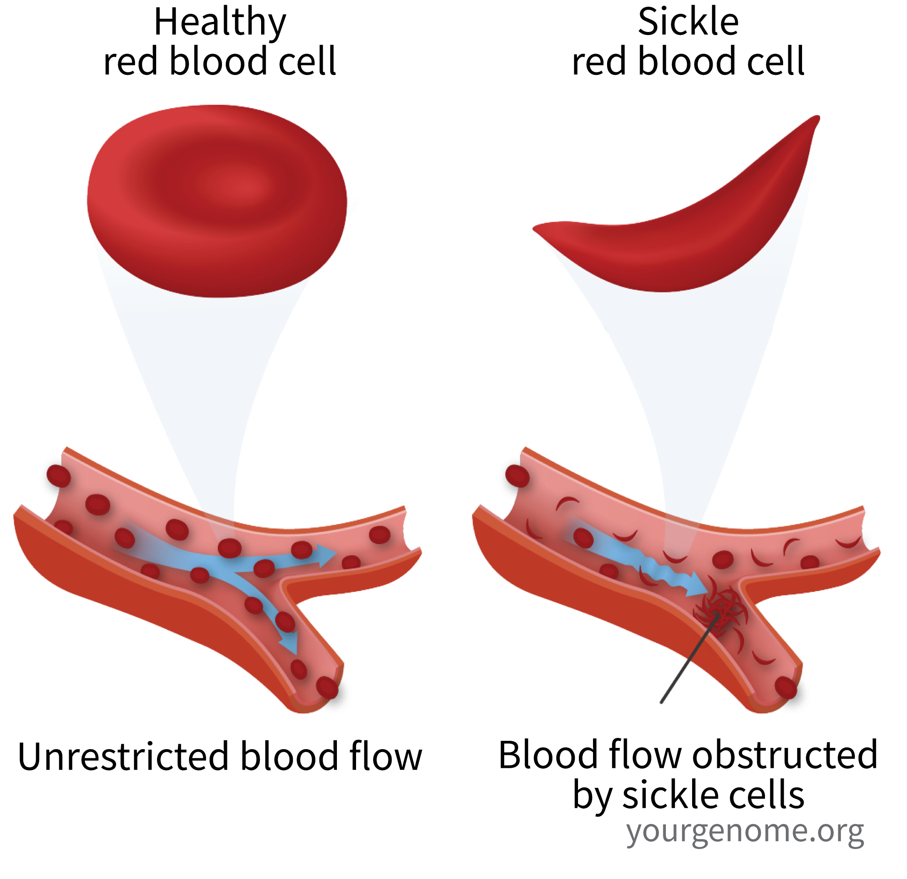
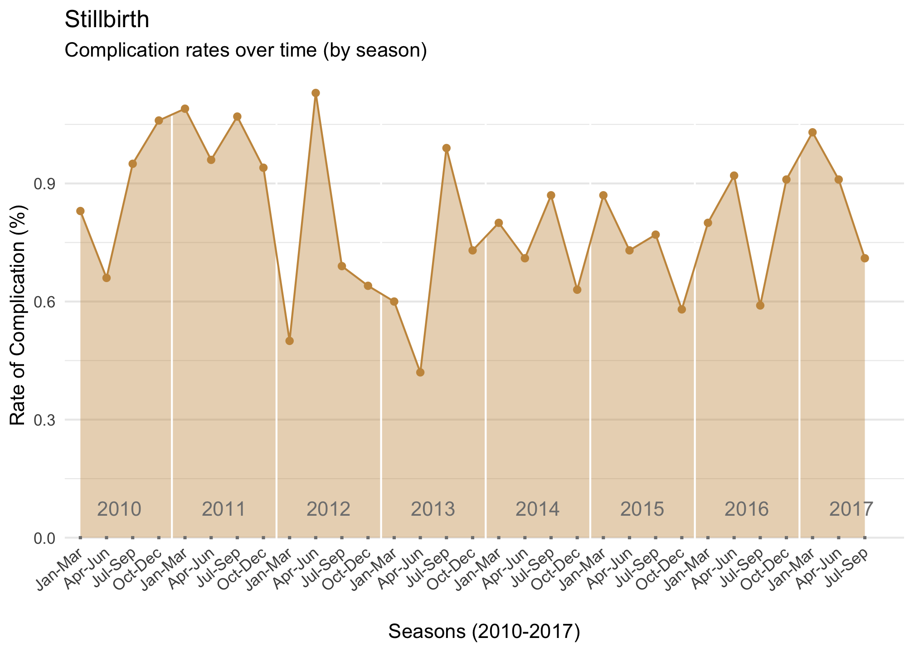
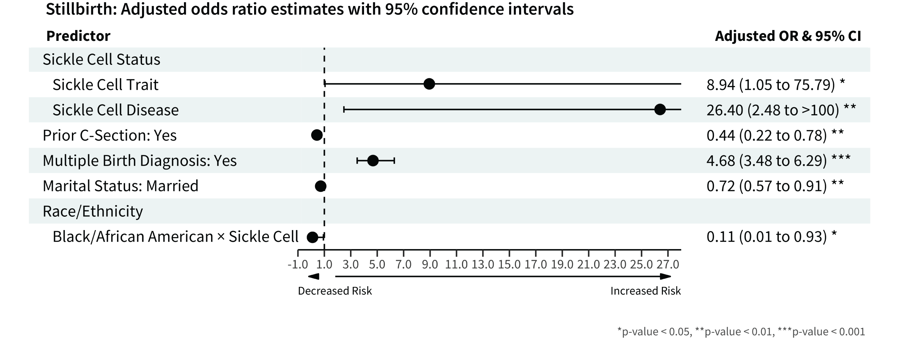
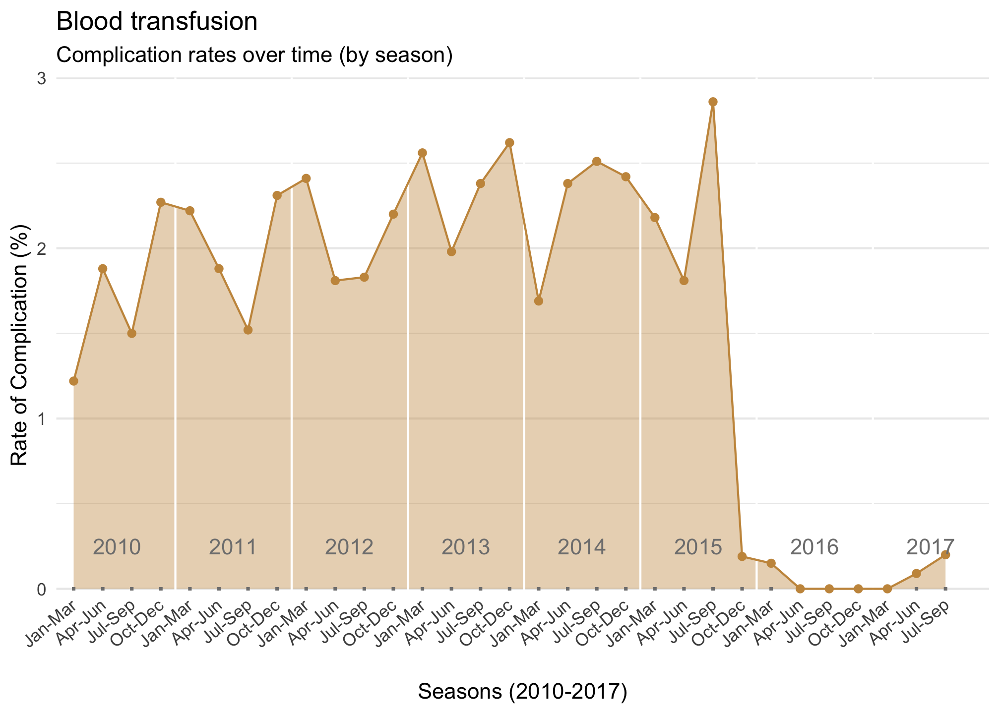
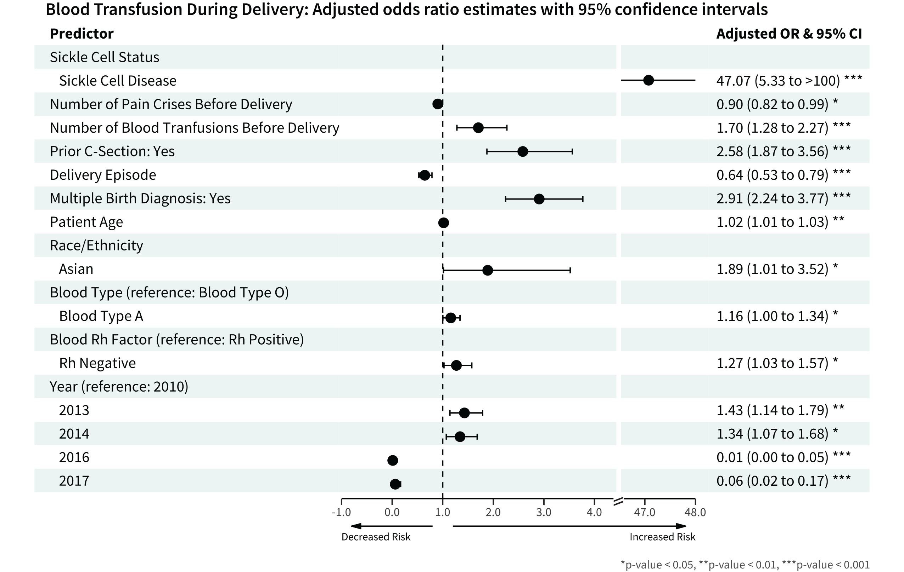
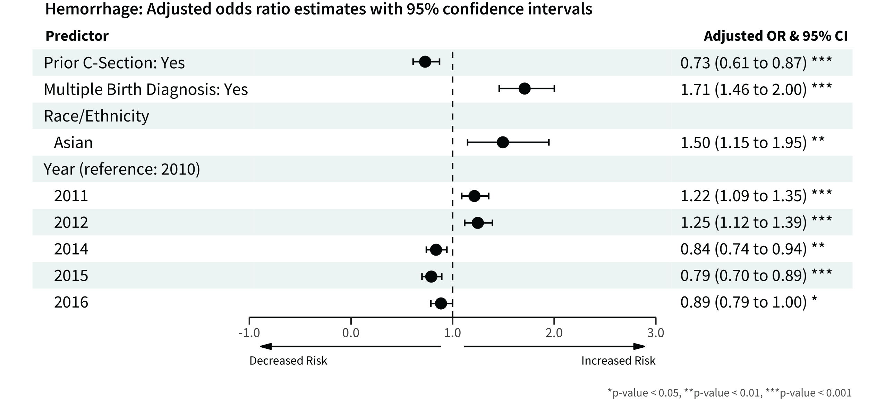

```{r meta, echo=FALSE, eval=FALSE}
library(metathis)
meta() %>%
  meta_general(
    description = "The Impact of Sickle Cell Status on Adverse Delivery Outcomes Using Electronic Health Record Data",
    generator = "xaringan and remark.js"
  ) %>% 
  meta_name("github-repo" = "spcanelon/xaringan-basics-and-beyond") %>% 
  meta_social(
    title = "2021 AMIA Informatics Summit | Silvia Canelón, PhD",
    url = "https://spcanelon.github.io/2021-AMIA-sickle-cell/",
    image = "https://raw.githubusercontent.com/spcanelon/2021-AMIA-sickle-cell/master/cover-image.png?token=AL4Z36N3FHBVKFBCQR7WOB3AMDZPI",
    image_alt = "Title slide for the podium talk presentation",
    og_type = "website",
    og_author = "Silvia Canelón",
    twitter_card_type = "summary_large_image",
    twitter_creator = "@spcanelon"
  )
```

```{r setup, include=FALSE, eval = TRUE}
#options(htmltools.dir.version = FALSE)
knitr::opts_chunk$set(collapse = TRUE,
                      fig.retina = 3,
                      cache = FALSE,
                      warning = FALSE,
                      message = FALSE,
                      echo = FALSE)

library(tidyverse)
library(knitr)
library(showtext) 
library(fontawesome)
library(formattable)
library(kableExtra)
library(xaringanExtra)

xaringanExtra::use_xaringan_extra(c("webcam",
                                    "tile_view",
                                    "panelset",
                                    "share_again"))
xaringanExtra::style_share_again(
  share_buttons = c("twitter", "linkedin", "pocket")
)

knitr::opts_chunk$set(echo = FALSE, 
                      warning = FALSE, 
                      message = FALSE, 
                      comment = NA, 
                      dpi = 300, 
                      fig.align = "center", 
                      out.width = '72%', 
                      cache = FALSE)

options(scipen = 999)
```

```{r xaringan-logo, include=FALSE}
xaringanExtra::use_logo(
  image_url = "https://raw.githubusercontent.com/rstudio/hex-stickers/master/PNG/xaringan.png"
)
```

```{r import, include=FALSE}
overall <- read_rds("data/df_overall_main.rds")
models <- read_rds("data/models_general_int_all.rds") %>%
  mutate(across(.cols = c(OR, `2.5`, `97.5`), as.numeric)) %>%
  mutate(across(.cols = c(OR, `2.5`, `97.5`), round, 2)) %>%
  mutate(across(.cols = c(OR, `2.5`, `97.5`), format, nsmall = 2, trim = TRUE)) %>%
  mutate(aOR_CI = glue::glue("{OR} ({`2.5`} - {`97.5`})"))
summary_sc <- read_rds("data/distribution_scstatus.rds") %>%
  ungroup()
summary_race <- read_rds("data/distribution_race.rds")
```


class: title-slide, left, top
background-image: url(img/AMIA-title-slide-1.png)
background-size: cover
background-position: center


# The Impact of Sickle Cell Status on<br>Adverse Delivery Outcomes Using<br>Electronic Health Record Data
## `r rmarkdown::metadata$session`
### **`r rmarkdown::metadata$author`**
### `r rmarkdown::metadata$institute`
### `r fontawesome::fa("twitter", a11y = "sem")` @spcanelon **#IS21**

<!--S17: Oral Presentations - Applied CRI: Solving Real World Problems, March 23, 2021 from 11:30 AM to 1:00 PM-->

---
class: middle, center, inverse

.pull-left-equal[

.center[
# About me


**Postdoctoral Research Scientist<br>University of Pennsylvania**

```{r}
knitr::include_graphics("img/DBEI_PSOM_color_darkbkg.png")
```

_I have no relevant relationships<br>with commercial interests to disclose_

]]

--

.pull-right-equal[

### Principal Investigator

Mary Regina Boland, MPhil, PhD, FAMIA

### Collaborator

Samantha Butts, MSCE, MD

### Boland Lab

Lena Davidson &#8226; Jessica Meeker<br>
Aditya Kashyap &#8226; Bernadette D'Alonzo<br>
Becca Morse &#8226; Sarah Tadlock &#8226; Ella Poole<br>
Jessica Liu &#8226; Abigail Bretzin<br><br>
]

---
layout: true

<a class="footer-link" href="http://bit.ly/AMIA-sickle-cell"><strong>bit.ly/AMIA-sickle-cell</strong>
&#8226; Silvia P. Canelón &#8226; 2021 AMIA Informatics Summit</a>
<!-- this adds the link footer to all slides, depends on footer-link class in css-->

---
class: middle

# Learning objectives

----

### Understand how electronic health record (**EHR**) data were leveraged<br> to study the impact of **sickle cell disease** on adverse:

- ### delivery outcomes including **stillbirth** 
- ### hematological outcomes like **blood transfusion** and **hemorrhage**<br>during delivery.

---
class: highlight-last-item

# Motivation

- ### Pregnant people are often underrepresented in clinical research,<br>as are ethnic and racial minorities

--

- ### Those pregnant with sickle cell have been shown to be at an<br>increased risk of adverse outcomes [1]

--

- ### The granularity of our dataset enables the study of pregnancy-specific contributions to the risk of a clinical complication at the time of delivery

--

- ### We estimate a higher incidence of sickle cell trait at Penn Medicine (~9.8%) compared to national estimates (~7.7%) [2]


.footnote[
1. Barfield WD, Barradas DT, Manning SE, et al. Am J Prev Med. 2010;38:S542–9
2. Centers for Disease Control and Prevention. Data & Statistics on Sickle Cell Disease. 2017
]

???
The size of our dataset makes studying pregnancy outcomes among people with sickle cell trait and sickle cell disease feasible

---
class: highlight-last-item

# Analysis

1. ### Used our MADDIE algorithm [1] to identify **63,334 distinct deliveries**<br>from EHR of **1,060,000 female patients** with visits to<br>Penn Medicine between **2010-2017**

--

2. ### Identified **delivery and hematological outcomes of interest** <br>occurring within the patients' delivery episode(s)

--

3. ### Constructed **generalized logistic regression model** to assess<br>the risk of a variety of predictors on delivery and hematological outcomes

.footnote[
1\. [Canelón et al. Int J Med Inform (2020)](https://silvia.rbind.io/publication/maddie-ehr-delivery-episode-algorithm/)]

---
<!--background-image: url(img/SickleCellDiagram.png)
background-size: 50%-->

.pull-left-equal[
# Sickle cell disease

- Complex inherited genetic disorder and<br>most common hemoglobinopathy<br>in the U.S., affecting ~100,000 people [1]
- Primarily affects individuals of African ancestry and is associated with high lifetime morbidity and premature mortality [2]
- Inheriting one hemoglobin S gene results in **sickle cell trait**; inheriting two abnormal genes results in **sickle cell disease**
- The disease is characterized by abnormal hemoglobin and "sickle" red blood cells

.footnote[
1\. Centers for Disease Control and Prevention. Data & Statistics on Sickle Cell Disease. 2017<br>
2\. Kuo K, Caughey AB. Am J Obstet Gynecol. 2016;215(4)]
]

.pull-right-equal[

```{r, out.width="100%", fig.alt="Healthy red blood cells vs. sickle red blood cells. Healthy red blood cells allow unrestricted blood flow whereas sickle red blood cells are shaped like a 'sickle', hard, and sticky which leads to obstructed blood flow. Image source: yourgenome.org."}

```

]

???
The sickle cells die early, which causes a constant shortage of red blood cells, or anemia.

Sickle cells are also hard and sticky and block capillaries causing myriad downstream effects including debilitating pain and other serious problems such as infection, acute chest syndrome, and stroke.

To help prevent these complications and manage their condition, people with sickle cell often require blood transfusions.

People with sickle cell trait still produce sickle cells, but perhaps not at a level that would result in detectable symptoms

Alt-text: Healthy red blood cells vs. sickle red blood cells. Healthy red blood cells allow unrestricted blood flow whereas sickle red blood cells are shaped like a 'sickle', hard, and sticky which leads to obstructed blood flow. Image source: yourgenome.org.

---
background-image: url(img/StudyOverview.png)
background-size: 70%
background-position: 50% 70%
class: left

# Study overview

???
Process diagram describing the steps taken in the study: 

1. Identifying patients with deliveries within the Electronic Health Record dataset using ICD codes for delivery
2. Using the MADDIE algorithm to identify distinct deliveries per patient
3. Using ICD codes to identify patients with a sickle cell diagnosis, sickle cell trait OR sickle cell disease

---
background-image: url(img/PregTimeline-1.png)
background-size: 85%
background-position: 50% 150px

# Identifying delivery episodes with the MADDIE algorithm

???
Diagram depicting a patient's timeline of delivery encounters with the Penn Medicine health system. Delivery ICD codes are assigned on multiple days surrounding the true date of delivery. The MADDIE algorithm assumes that delivery encounters separated by 180 days or more can be considered to be a part of distinct delivery episodes, or distinct pregnancies.

---
background-image: url(img/PregTimeline-2.png)
background-size: 85%
background-position: 50% 150px

# Identifying outcomes within delivery episodes

???
Same diagram depicting a patient's timeline of deliveries, but this version also includes icons pregnancy-related outcomes mapped onto distinct delivery episodes (outcomes also identified using ICD codes).

---

.left-col-narrow[
# Patient population at Penn Medicine
]

.right-col-wide[

```{r}
summary_sc_filter <-
  summary_sc %>%
  select(PATIENTS_PRINT, DELIVERIES_PRINT)

rownames(summary_sc_filter) <- c("All Patients", "No Sickle Cell",
                                 "Sickle Cell Mutation",
                                 "Sickle Cell Trait",
                                 "Sickle Cell Disease")
summary_sc_filter %>%
  kableExtra::kbl(row.names = T, 
                  col.names = c("Patients (%)", "Deliveries (%)")) %>%
  kable_paper(c("hover"),
              font_size = 20, html_font = "Source Sans Pro", full_width = F) %>%
  row_spec(row = c(3), color = "black", background = "#edcdd6") %>%
  add_indent(4:5) %>%
  column_spec(1, width = "10em") %>%
  column_spec(2:3, width = "8em")
```
<br>
```{r}
summary_race_filter <-
  summary_race %>%
  filter(SC_STATUS == "SC") %>%
  mutate(PATIENTS_PRINT = as.character(PATIENTS_PRINT),
         DELIVERIES_PRINT = as.character(DELIVERIES_PRINT),
         PATIENTS_R = as.character(PATIENTS_R)) %>%
  ungroup() %>%
  mutate(RACE = case_when(
    RACE == "ALL_RACES" ~ "All Patients",
    RACE == "HISPANIC" ~ "Hispanic",
    RACE == "NH_AFAM" ~ "Black/African American",
    RACE == "NH_ASIAN" ~ "Asian",
    RACE == "NH_OTHER_MIXED" ~ "Other or Mixed",
    RACE == "NH_UNKNOWN" ~ "Unknown",
    RACE == "NH_WHITE" ~ "White"))

summary_race_filter %>%
  select(RACE, PATIENTS_PRINT, DELIVERIES_PRINT) %>%
  kableExtra::kbl(col.names = c( "Race/Ethnicity", "Patients (%)", "Deliveries (%)")) %>%
  kable_paper("hover", font_size = 20, html_font = "Source Sans Pro", full_width = F) %>%
  pack_rows("Sickle Cell Mutation", start_row = 1, end_row = 7) %>%
  row_spec(row = c(3), color = "black", background = "#edcdd6") %>%
  footnote(general_title = "", "All race/ethnicity descriptions are 'Non-Hispanic' unless otherwise indicated") %>%
  column_spec(1, width = "14em") %>%
  column_spec(2:3, width = "8em")
  
```

]

---
# Logistic regression model

.pull-left-equal[

### Delivery outcomes

- C-Section
- Preterm birth
- Stillbirth

### Hematological outcomes

- Blood transfusion
- Hemorrhage
- Pain crisis

]

--

.pull-right-equal[
### Predictors
- **Sickle cell status (SCT, SCD)**
- **No. of pain crisis before delivery**
- **No. of blood transfusions before delivery**
- Delivery episode
- Prior C-section
- Multiple birth diagnosis
- Patient age
- Marital status
- Race/ethnicity
- Blood type and blood Rh factor
- Year
]


---
# Logistic regression model

.pull-left-equal[

### Delivery outcomes

- C-Section
- Preterm birth
- .highlight[Stillbirth]

### Hematological outcomes

- .highlight[Blood transfusion]
- .highlight[Hemorrhage]
- Pain crisis

]

.pull-right-equal[
### Predictors
- **Sickle cell status (SCT, SCD)**
- **No. of pain crisis before delivery**
- **No. of blood transfusions before delivery**
- Delivery episode
- Prior C-section
- Multiple birth diagnosis
- Patient age
- Marital status
- Race/ethnicity
- Blood type and blood Rh factor
- Year
]

---
background-image: url(img/season-stillbirth.png)
background-size: 70%
background-position: 50% 50%

.white[

# Stillbirth: Rates over time
]

```{r, echo=FALSE, eval=FALSE, fig.alt="Line graph showing stillbirth rates from 2010-2017 and broken down by seasons (e.g. January to March, April to June, etc.). Stillbirth rates oscillated with a max around ~1.1% in 2012 and a low of ~0.4% in 2013"}

```

???
Line graph showing stillbirth rates from 2010-2017 and broken down by seasons (e.g. January to March, April to June, etc.). Stillbirth rates oscillated with a max around ~1.1% in 2012 and a low of ~0.4% in 2013

---
background-image: url(img/ForestPlot_Stillbirth-Sig.png)
background-size: 70%
background-position: 50% 50%

# Stillbirth: Model results

```{r, out.width = "8%", eval=FALSE, fig.alt="Forest plot showing model results where sickle cell trait (aOR 8.94) and sickle cell disease (aOR 26.4) increase the risk of stillbirth. Please see presenter notes for link to table presentation."}

```

.footnote[
**Non-significant predictors:** Number of pain crisis before delivery; number of blood transfusions before delivery;<br>delivery episode; patient age; blood type; blood Rh factor, year
]

???
The odds of having a stillbirth for someone who identifies as Black/African American versus not is considerably lower for those with SC versus those without

Alt-text: Please navigate to the slide titled "[Tables of significant model results](#table-view)" for an interactive table view of these results 

---
background-image: url(img/season-blood-transfusion.png)
background-size: 70%
background-position: 50% 50%

.white[
# Blood transfusion: Rates over time
]

```{r, eval=FALSE, fig.alt="Line graph showing blood transfusion rates from 2010-2017 and broken down by seasons. Blood transfusion rates oscillated with a 'reasonable' low ~1.2% in 2010 and high around ~2.8% in 2015. 'Unreasonable' lows near 0% are found in 2016 and 2017 but these are due to a change in ICD coding practices. Please see Limitations slide for more details."}

```

???
Line graph showing blood transfusion rates from 2010-2017 and broken down by seasons. Blood transfusion rates oscillated with a "reasonable" low ~1.2% in 2010 and high around ~2.8% in 2015. "Unreasonable" lows near 0% are found in 2016 and 2017 but these are due to a change in ICD coding practices. Please see Limitations slide for more details.

---

# Blood transfusion: Model results

```{r, out.width="83%", fig.alt="Forest plot showing sickle cell disease (aOR 47.1) increased the risk of blood transfusion during delivery. Please see presenter notes for link to table presentation."}

```

.footnote[
**Non-significant predictors:** Marital status
]

???
Alt-text: Please navigate to the slide titled "[Tables of significant model results](#table-view)" for an interactive table view of these results 

---
background-image: url(img/season-hemorrhage.png)
background-size: 70%
background-position: 50% 50%

.white[
# Hemorrhage: Rates over time
]
```{r, eval=FALSE, fig.alt="Line graph showing hemorrhage rates from 2010-2017 and broken down by seasons. Hemorrhage rates with a high of ~11% in 2012, a low of ~5.4% in 2015, and hovering around ~6% from 2013-2017."}
knitr::include_graphics("../sickle-cell-pub/output/20210119/figures/season-all-outcomes-1.png")
```

???
Line graph showing hemorrhage rates from 2010-2017 and broken down by seasons. Hemorrhage rates with a high of ~11% in 2012, a low of ~5.4% in 2015, and hovering around ~6% from 2013-2017.

---
# Hemorrhage: Model results

```{r, out.width = "88%", fig.alt="Forest plot showing that neither sickle cell trait nor sickle cell disease were associated with an increased risk of hemorrhage during delivery. Please see presenter notes for link to table presentation."}

```

.footnote[
**Non-significant predictors:** Sickle cell status, number of pain crisis before delivery; number of blood transfusions before delivery;<br>delivery episode; patient age; blood type; blood Rh factor
]

???
Alt-text: Please navigate to the slide titled "[Tables of significant model results](#table-view)" for an interactive table view of these results 

---
# Limitations

--

- ### The study did not include data on hemoglobin variants which would help
  - ### Confirm sickle cell status
  - ### Identify additional patients with homozygous sickle cell disease
  - ### Identify heterozygous patients that are asymptomatic
  
--

- ### Billing codes (e.g. ICD-9/10) are imperfect at capturing clinical conditions

--

- ### Blood transfusion capture after the transition to ICD-10 was limited<br>by a change in coding practices [1]

.footnote[
1\. [AIM Severe Maternal Morbidity (SMM) Data Alert for Blood Transfusions. 2016](https://www.cmqcc.org/sites/default/files/AIM-SMM-Data-Alert-Blood-Transfusions-v4-15-2016%20%284%29.pdf)
]

???
In April of 2016 the Alliance for Innovation on Maternal Health (AIM) issued a data alert for blood transfusions after hearing that hospitals were electing not to code blood transfusions due to the complexity of codes accompanying ICD-10. 

The alert is linked on this slide and includes coding guidance to support staff 

---
class: middle, highlight-last-item

# Conclusions

--

----

- ### Patients with sickle cell disease were not found to be at increased risk of hemorrhage, a severe maternal morbidity.

--

- ### Pregnancies of patients with sickle cell were at increased risk<br>of blood transfusions and stillbirth.

--

- ### These results underscore the need for systemic support for comprehensive coordinated care for sickle cell patients,<br>particularly during pregnancy and delivery

---
class: inverse

# Publication

----

## You'll be able to view the full results and read more<br>about the study in our upcoming preprint.

### `r fontawesome::fa("link")` Stay tuned for updates on the webpage for this talk:<br>[The Impact of Sickle Cell Status on Adverse Delivery Outcomes Using Electronic Health Record Data](https://silvia.rbind.io/talk/2021-03-22-amia-informatics-summit/)

---
class: top, left, no-slide-number
layout: false
background-image: url(img/AMIA-title-slide-2.png)
background-size: cover


# Thank you!

.left[
[`r fontawesome::fa("link", a11y = "sem")` silvia.rbind.io](https://silvia.rbind.io)<br>
[`r fontawesome::fa("twitter", a11y = "sem")` @spcanelon](https://twitter.com/spcanelon)<br>
[`r fontawesome::fa("github", a11y = "sem")` @spcanelon](https://github.com/spcanelon)<br/>
]

.footnote[
This presentation was made using the<br>AMIA template and the following R packages:<br> [xaringan](https://github.com/yihui/xaringan#xaringan), [xaringanExtra](https://github.com/gadenbuie/xaringanExtra#xaringanextra), [kableExtra](https://haozhu233.github.io/kableExtra/), and [forester](https://github.com/rdboyes/forester).
]

---
exclude: false
name: table-view

.left-col-narrow[
# Tables of significant model results
]

```{r, eval = FALSE}
source("R/get_formatted_models.R")
```


```{r}
new_sb <- read_rds("data/formatted_models_stillbirth.Rds") %>%
  select(Predictor, aOR, PVALUE, SIG, `Adjusted OR & 95% CI`, FORMAT, OUTCOME)
new_bt <- read_rds("data/formatted_models_bloodtransfusion.Rds") %>%
  select(Predictor, aOR, PVALUE, SIG, `Adjusted OR & 95% CI`, FORMAT, OUTCOME)
new_hem <- read_rds("data/formatted_models_hemorrhage.Rds") %>%
  select(Predictor, aOR, PVALUE, SIG, `Adjusted OR & 95% CI`, FORMAT, OUTCOME)
```

.right-col-wide[
.panelset[

.panel[.panel-name[Stillbirth]
```{r, include = TRUE}
new_sb %>% 
  filter(!((PVALUE >= 0.05 | PVALUE == -1010) & !is.na(aOR))) %>%
  filter(!(Predictor %in% c("Blood Rh Factor (reference: Rh Positive)",
                     "Blood Type (reference: Blood Type O)",
                     "Year (reference: 2010)"))) %>%
  select(Predictor, `Adjusted OR & 95% CI`) %>%
  kableExtra::kbl() %>%
  kable_paper(c("condensed", "hover"), 
              font_size = 18, html_font = "Source Sans Pro",
              full_width = F) %>%
  row_spec(row = c(2,3,8), color = "black", bold = TRUE) %>%
  column_spec(1, width = "22em") %>%
  column_spec(2, width = "12em") %>%
  add_indent(c(2,3,8)) %>%
  footnote(general_title = "", "* pvalue < 0.05, ** p-value < 0.01, *** p-value < 0.001")
```

]<!--end of panel-->

.panel[.panel-name[Blood transfusion]

```{r, include = TRUE}
new_bt %>%
  filter(!((PVALUE > 0.05 | PVALUE == -1010) & !is.na(aOR))) %>%
  #filter(!(Predictor %in% c("Sickle Cell Status"))) %>%
  select(Predictor, `Adjusted OR & 95% CI`) %>%
  kableExtra::kbl() %>%
  kable_paper(c("condensed", "hover"), 
              font_size = 18, html_font = "Source Sans Pro", full_width = F) %>%
  row_spec(row = c(2,3,4), color = "black", bold = TRUE) %>%
  column_spec(1, width = "22em") %>%
  column_spec(2, width = "12em") %>%
  add_indent(c(2, 10, 12, 14, 16, 17, 18, 19)) %>%
  footnote(general_title = "", "* pvalue < 0.05, ** p-value < 0.01, *** p-value < 0.001")
```

]<!--end of panel-->

.panel[.panel-name[Hemorrhage]

```{r}
new_hem %>%
  # mutate(Risk = ifelse(aOR > 1, 
  #                      cell_spec("\\upuparrows", escape = FALSE), 
  #                      cell_spec("$\\symbol{8595}$"))) %>%
  filter(!((PVALUE >= 0.05 | PVALUE == -1010)) | is.na(aOR)) %>%
  filter(!(Predictor %in% c("Sickle Cell Status",
                            "Blood Type (reference: Blood Type O)",
                            "Blood Rh Factor (reference: Rh Positive)"))) %>%
  select(Predictor, `Adjusted OR & 95% CI`) %>%
  kableExtra::kbl() %>%
  kable_paper(c("condensed", "hover"), 
              font_size = 18, html_font = "Source Sans Pro", full_width = F) %>%
  column_spec(1, width = "22em") %>%
  column_spec(2, width = "12em") %>%
  add_indent(c(4,6,7,8,9,10)) %>%
  footnote(general_title = "", "* pvalue < 0.05, ** p-value < 0.01, *** p-value < 0.001")
```

]<!--end of panel-->

]<!--end of panelset-->
]
```{r, eval=FALSE}
xaringanBuilder::build_pdf("index.html", complex_slides = TRUE)
```

