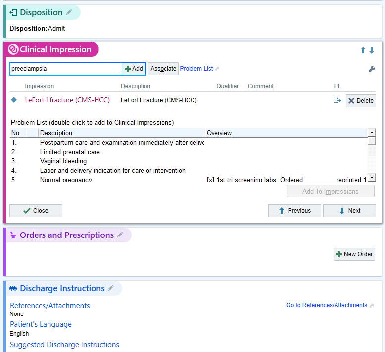

```{r meta, echo=FALSE, eval=FALSE}
library(metathis)
meta() %>%
  meta_social(
    title = "Lessons Learned from the EHR | Silvia Canelón",
    description = "What I've Learned from Working with Electronic Health Record Data. A talk for the Toronto Data Workshop",
    url = "https://slides.silviacanelon.com/2022-tdw-ehr-lessons",
    image = "https://slides.silviacanelon.com/2022-tdw-ehr-lessons/social-card.png",
    image_alt = "",
    twitter_card_type = "summary_large_image",
    twitter_creator = "@spcanelon"
  )
```

```{r xaringanthemer, echo=FALSE, warning=FALSE}
library(xaringanthemer)
# creating a custom CSS stylesheet using xaringanthemer
# xaringanthemer package documentation: https://pkg.garrickadenbuie.com/xaringanthemer/reference/style_duo_accent.html
style_duo_accent(
  primary_color = "#172D40",   # bright blue from the logo (headers, inverse slides)
  secondary_color = "#108FFF", # bright blue (links and bold words)
  white_color = "#fefefe", # off-white color (text)
  black_color = "#172D40", # dark navy blue color (slide background)
  base_font_size = "20px",
  header_h1_font_size = "1.7em",
  header_h2_font_size = "1.5em",
  header_h3_font_size = "1.3em",
  link_decoration = "underline 1px",
  table_row_even_background_color = "#313C54", # lighter navy color
  inverse_link_color = "#fdfdfd", # off-white color
  code_highlight_color = "#ECECCE", # beige color
  header_background_content_padding_top = "5rem",
  #footnote_position_bottom = "40px",
  outfile = "css/xaringan-themer.css",
  text_font_family = "Red Hat Text",
  text_font_google = google_font("Red Hat Text"),
  header_font_google = google_font("Commissioner"),
  extra_css = list(
    # the following css styles the horizontal bars
    "hr" = list("color" = "#108FFF",
                "content" = "''",
                "display" = "block",
                "border" = "none",
                "background-color" = "#108FFF",
                "height" = "0.1em"),
    # the following css styles the list markers to apply the primary color
    "li::marker" = list("content" = "&#8226;",
                        "color" = "#108FFF"))
)
```

```{r setup, include=FALSE, eval = TRUE}
xfun::pkg_attach(c(
  "tidyverse",
  "fontawesome"
))

xaringanExtra::use_xaringan_extra(c("webcam",
                                    "tile_view",
                                    "panelset",
                                    "share_again"))
xaringanExtra::style_share_again(
  share_buttons = c("twitter", "linkedin", "pocket")
)

knitr::opts_chunk$set(echo = FALSE, 
                      warning = FALSE, 
                      message = FALSE, 
                      comment = NA, 
                      dpi = 300, 
                      fig.align = "center", 
                      out.width = '72%', 
                      cache = FALSE)

options(scipen = 999)
```


```{r import, include=FALSE}
overall <- read_rds("data/df_overall_main.rds")
models <- read_rds("data/models_general_int_all.rds") %>%
  mutate(across(.cols = c(OR, `2.5`, `97.5`), as.numeric)) %>%
  mutate(across(.cols = c(OR, `2.5`, `97.5`), round, 2)) %>%
  mutate(across(.cols = c(OR, `2.5`, `97.5`), format, nsmall = 2, trim = TRUE)) %>%
  mutate(aOR_CI = glue::glue("{OR} ({`2.5`} - {`97.5`})"))
summary_sc <- read_rds("data/distribution_scstatus.rds") %>%
  ungroup()
summary_race <- read_rds("data/distribution_race.rds")
```


class: title-slide, left, middle, inverse
<!--background-image: url(img/tdw-hex.png)
background-size: 200px
background-position: 18% 13%-->

.left-col-narrow[.center[
```{r out.width="70%", eval=TRUE, fig.alt='Toronto Data Workshop'}
knitr::include_graphics("img/tdw-hex.png")
```
]]

.right-col-wide[
.left[
# `r rmarkdown::metadata$title`
<!--medical database-->
<svg fill="#FFFFFF" width="50pt" height="50pt" version="1.1" viewBox="0 0 100 100" xmlns="https://www.w3.org/2000/svg">
 <path d="m49.57 89.203c-20 2.332-46.258-1.4727-46.258-11.535v-15.949c0-0.61328 0.12109-1.1055 0.24609-1.5938 8.0977 6.1367 26.012 8.5898 41.965 7.3633 0.24609-1.1055 0.61328-2.207 1.1055-3.3125-19.508 1.7188-43.312-2.207-43.312-11.777v-15.949c0-0.24609 0-0.49219 0.12109-0.85938 13.25 10.551 54.848 10.551 68.223 0v0.85938 11.656c13.863 0.49219 25.031 11.902 25.031 26.012 0 14.234-11.656 25.891-26.012 25.891-8.7109 0-16.441-4.293-21.105-10.797zm25.645-1.8398h-9.0781v-8.8359h-8.8359v-8.957h8.8359v-8.8359h9.0781v8.8359h8.7109v8.957h-8.7109zm-4.5391-33.988c11.41 0 20.613 9.3242 20.613 20.734s-9.2031 20.613-20.613 20.613c-11.41 0-20.613-9.2031-20.613-20.613s9.2031-20.734 20.613-20.734zm0.98047-41.227v15.949c0 16.195-68.344 16.195-68.344 0v-15.949c0-16.195 68.344-16.195 68.344 0z" fill-rule="evenodd"/>
</svg>
<!--searching-->
<svg fill="#FFFFFF" width="50pt" height="50pt" version="1.1" viewBox="0 0 100 100" xmlns="https://www.w3.org/2000/svg">
 <path d="m70.371 20.059c9.9141-2.2422 19.77 3.9727 22.012 13.891 1.9883 8.8008-2.6875 17.555-10.695 20.98l6.0391 17.32c1.8398 5.2773 0.64063 10.469-1.3711 10.926l-3.2539 0.73828c-2.0078 0.45313-5.3281-3.7188-5.9375-9.2734l-2-18.234c-8.707 0.35547-16.691-5.5352-18.684-14.336-2.2422-9.918 3.9766-19.77 13.891-22.012zm-44.363 0.59766h37.457c-2.3516 1.4844-4.3516 3.418-5.9023 5.6562h-31.559c-1.0898 0-1.9609 0.87109-1.9609 1.9609v54.047c0 1.0859 0.87109 1.9609 1.9609 1.9609h43.129c1.0859 0 1.9609-0.87109 1.9609-1.9609v-24.059c0.71094 0.11719 1.4336 0.19531 2.1641 0.23828l1.7969 16.359c0.074218 0.70703 0.19531 1.4062 0.34766 2.082 0.32031 1.418 0.79297 2.7266 1.3516 3.875v1.5039c0 4.1836-3.4375 7.6172-7.6172 7.6172h-43.129c-4.1836 0-7.6211-3.4336-7.6211-7.6172v-54.047c0-4.1836 3.4336-7.6172 7.6211-7.6172zm-11.227-10.598h43.129c4.1836 0 7.6211 3.4375 7.6211 7.6172v0.85938h-5.6602v-0.85938c0-1.0859-0.87109-1.9609-1.9609-1.9609h-43.129c-1.0898 0-1.9609 0.87109-1.9609 1.9609v54.047c0 1.0859 0.87109 1.9609 1.9609 1.9609h1.4883v5.6562h-1.4883c-4.1836 0-7.6211-3.4336-7.6211-7.6172v-54.047c0-4.1836 3.4336-7.6172 7.6211-7.6172zm13.051 56.559h39.488v3.6836h-39.488zm0 8.9141h39.488v3.6836h-39.488zm0-17.828h39.488v3.6836h-39.488zm0-8.9141h29.133c0.83203 1.3477 1.8086 2.5781 2.9062 3.6836h-32.039zm0-17.406h27.176c-1.3438 3.9219-1.457 8.1836-0.33594 12.172h-26.844v-12.172zm43.828-5.6367c6.7734-1.5312 13.504 2.7148 15.035 9.4883s-2.7148 13.504-9.4883 15.035c-6.7734 1.5312-13.504-2.7148-15.039-9.4883-1.5312-6.7734 2.7148-13.504 9.4922-15.035z" fill-rule="evenodd"/>
</svg>
<!--algorithm-->
<svg fill="#FFFFFF" width="50pt" height="50pt" version="1.1" viewBox="0 0 100 100" xmlns="https://www.w3.org/2000/svg">
 <g>
  <path d="m96.875 23.438c0-3.7734-2.6875-6.9297-6.25-7.6562v-9.5312c0-0.86328-0.69922-1.5625-1.5625-1.5625h-23.438v-3.125c0-0.86328-0.69922-1.5625-1.5625-1.5625h-28.125c-0.86328 0-1.5625 0.69922-1.5625 1.5625v3.125h-10.938c-0.86328 0-1.5625 0.69922-1.5625 1.5625v15.625h-10.938c-0.86328 0-1.5625 0.69922-1.5625 1.5625v14.219c-3.5625 0.72656-6.25 3.8828-6.25 7.6562s2.6875 6.9297 6.25 7.6562v14.219c0 0.86328 0.69922 1.5625 1.5625 1.5625h23.438v3.125c0 0.86328 0.69922 1.5625 1.5625 1.5625h12.5v4.8125c-5.2891 0.76172-9.375 5.3125-9.375 10.812 0 6.0312 4.9062 10.938 10.938 10.938 5.5 0 10.051-4.0859 10.812-9.375h17.312c0.86328 0 1.5625-0.69922 1.5625-1.5625v-42.188h9.375c0.86328 0 1.5625-0.69922 1.5625-1.5625v-14.219c3.5625-0.72656 6.25-3.8828 6.25-7.6562zm-59.375-20.312h25v6.25h-25zm-12.5 4.6875h9.375v3.125c0 0.86328 0.69922 1.5625 1.5625 1.5625h12.5v4.6875h-12.5c-0.86328 0-1.5625 0.69922-1.5625 1.5625v3.125h-9.375zm25 46.34-8.8398-8.8398 8.8398-8.8398 8.8398 8.8398zm-12.5-27.59v-6.25h25v6.25zm-31.25 18.75c0-2.5859 2.1016-4.6875 4.6875-4.6875s4.6875 2.1016 4.6875 4.6875-2.1016 4.6875-4.6875 4.6875-4.6875-2.1016-4.6875-4.6875zm28.125 17.188v3.125h-21.875v-12.656c3.5625-0.72656 6.25-3.8828 6.25-7.6562s-2.6875-6.9297-6.25-7.6562v-12.656h21.875v3.125c0 0.86328 0.69922 1.5625 1.5625 1.5625h12.5v3.9297l-10.133 10.133h-3.9297v3.125h3.9297l10.133 10.133v3.9297h-12.5c-0.86328 0-1.5625 0.69922-1.5625 1.5625zm3.125 1.5625h25v6.25h-25zm12.5 32.812c-4.3086 0-7.8125-3.5039-7.8125-7.8125s3.5039-7.8125 7.8125-7.8125 7.8125 3.5039 7.8125 7.8125-3.5039 7.8125-7.8125 7.8125zm26.562-9.375h-15.75c-0.6875-4.7812-4.4688-8.5625-9.25-9.25v-4.8125h12.5c0.86328 0 1.5625-0.69922 1.5625-1.5625v-9.375c0-0.86328-0.69922-1.5625-1.5625-1.5625h-12.5v-3.9297l10.133-10.133h14.867zm-14.867-43.75-10.133-10.133v-3.9297h12.5c0.86328 0 1.5625-0.69922 1.5625-1.5625v-9.375c0-0.86328-0.69922-1.5625-1.5625-1.5625h-12.5v-4.6875h12.5c0.86328 0 1.5625-0.69922 1.5625-1.5625v-3.125h21.875v7.9688c-3.5625 0.72656-6.25 3.8828-6.25 7.6562s2.6875 6.9297 6.25 7.6562v12.656zm27.367-15.625c-2.5859 0-4.6875-2.1016-4.6875-4.6875s2.1016-4.6875 4.6875-4.6875 4.6875 2.1016 4.6875 4.6875-2.1016 4.6875-4.6875 4.6875z"/>
  <path d="m21.875 43.75h3.125v3.125h-3.125z"/>
  <path d="m28.125 43.75h3.125v3.125h-3.125z"/>
 </g>
</svg>
]]

----


.right-col-wide[

.pull-left-equal[


]<!--end pull left-->

.pull-right-equal[
.right[
`r rmarkdown::metadata$author`<br>`r rmarkdown::metadata$institute`<br>@spcanelon `r fontawesome::fa("twitter", a11y = "sem")`
]<!--end pull right-->
]]

---
class: middle, center, inverse

.center[
# About me


Postdoctoral Research Scientist<br>University of Pennsylvania

```{r, out.width="30%"}

```
]

---
layout: true

<a class="footer-link" href="https://slides.silviacanelon.com/2022-tdw-ehr-lessons"><strong>slides.silviacanelon/2022-tdw-ehr-lessons</strong>
&#8226; 2022 Toronto Data Workshop</a>
<!-- this adds the link footer to all slides, depends on footer-link class in css-->


---
class: middle

# Biomedical informatics

> [T]he field that is concerned with the optimal use of information, often aided by the use of technology, to improve individual health, health care, public health, and biomedical research. <br>
.right[[Oregon Health & Science University](https://www.ohsu.edu/school-of-medicine/medical-informatics-and-clinical-epidemiology/what-biomedical-informatics)]

---
class: middle

# Our journey together

----
--

- EHR data
--

- Data mining
--

- Data mysteries
--

- Data privacy

---

.pull-left-equal[
# Structured data
- **Problem list**<br>(descriptions, billing codes)
- Important dates
- Medications
- Allergies
- Demographics (e.g. age, race/ethnicity, address, religion)
]

.pull-right-equal[
```{r, out.width="100%"}
#| fig.alt:  

```
]

---
background-image: url(img/EHR_example.png)
background-size: contain
background-position: top

<span role="img" aria-label="Mock medical chart for patient Mickey Mouse, contains ICD codes, medication, allergies, among other things"></span>

---

.pull-left-equal[
# Unstructured data
- Also known as **clinical notes**
- Analyzed using natural language processing
- Not standardized
- Can contain abbreviations, typos
- Can contain stigmatizing language & reflect provider bias   
  - descriptors like "refused," "(not) compliant," "agitated"
]

.footnote[
[Negative Patient Descriptors: Documenting Racial Bias In The Electronic Health Record | Health Affairs](https://www.healthaffairs.org/doi/full/10.1377/hlthaff.2021.01423)
]
--

.pull-right-equal[
<blockquote class="twitter-tweet" data-theme="light"><p lang="en" dir="ltr">Today I saw a new dermatologist after MONTHS of waiting for appt. I had hoped for a productive visit but we ended up pissing off each other. Dr: &quot;You can get a bougie facewash at Ulta for $50 if you want, but it won&#39;t work&quot; 🙄 Wonder what I said that this is in my visit notes 🤣 <a href="https://t.co/BNm7Ciu71R">pic.twitter.com/BNm7Ciu71R</a></p>&mdash; Mine Çetinkaya-Rundel (@minebocek) <a href="https://twitter.com/minebocek/status/1472039162454986756?ref_src=twsrc%5Etfw">December 18, 2021</a></blockquote> <script async src="https://platform.twitter.com/widgets.js" charset="utf-8"></script> 
]

---
class: middle

# Data mining
--

- Data of interest isn't always readily available
--

- Data may be unlinked, incomplete, inaccurate, dense
--

- Sometimes we need to develop data mining algorithms to get the information we need! 🔍

---
background-image: url(img/PregTimeline-1.png)
background-size: 85%
background-position: 50% 150px

# Identifying individual deliveries

<span role="img" aria-label="Diagram depicting a patient's timeline of delivery encounters with the Penn Medicine health system. Delivery ICD codes are assigned on multiple days surrounding the true date of delivery. The MADDIE algorithm assumes that delivery encounters separated by 180 days or more can be considered to be a part of distinct delivery episodes, or distinct pregnancies."></span>

???
- MADDIE: PennMedicine does not link maternal records with children's records

---
background-image:url(img/maddie.jpg)
background-size: 70%
background-position: 130% 50%

.pull-left[
# Algorithm

- Started with records <br>from 1 million+ female patients over 7 years
- Ended with 50,560 patients with deliveries & 63,334 distinct deliveries
]

<span role="img" aria-label="Diagram depicting a patient's timeline of delivery encounters with the Penn Medicine health system. Delivery ICD codes are assigned on multiple days surrounding the true date of delivery. The MADDIE algorithm assumes that delivery encounters separated by 180 days or more can be considered to be a part of distinct delivery episodes, or distinct pregnancies."></span>

.footnote[[Development and evaluation of MADDIE: Method to Acquire<br> Delivery Date Information from Electronic health records](https://www-sciencedirect-com.proxy.library.upenn.edu/science/article/pii/S1386505620309588?via%3Dihub)
]

<div id="square"></div>

---
background-image: url(img/PregTimeline-2.png)
background-size: 85%
background-position: 50% 150px

# Identifying outcomes within delivery episodes

<span role="img" aria-label="Same diagram depicting a patient's timeline of deliveries, but this version also includes icons for pregnancy-related outcomes mapped onto distinct delivery episodes (outcomes also identified using ICD codes)."></span>

---
class: middle

# Data mysteries
--

- Let's solve some data mysteries together! 🕵🏽

---

# Case No. 1

- We imported curated ICD codes from an external spreadsheet
- We subset our patient records using the imported ICD codes
- We should be left with patients with fallopian tube procedures in our records, but they are missing. Why? 🤔

| Code | Code description | Function
|:--- | :--- | :-- |
|66| Operations on fallopian tubes| Broad category of codes
|66.0| Salpingotomy and salpingostomy| Specific code

--
**Culprit:** Excel cut off the trailing zero from all codes in the spreadsheet!

---
class: right
background-image: url(img/season-hemorrhage.png)
background-size: 70%
background-position: left

<span role="img" aria-label="Line graph showing hemorrhage rates from 2010-2017 and broken down by seasons. Hemorrhage rates with a high of ~11% in 2012, a low of ~5.4% in 2015, and hovering around ~6% from 2013-2017."></span>

# Case No. 2
Example:<br>Hemorrhage<br>rates over time

--

We see some ups<br> and downs over time

---
class: right
background-image: url(img/season-blood-transfusion.png)
background-size: 70%
background-position: left

<span role="img" aria-label="Line graph showing blood transfusion rates from 2010-2017 and broken down by seasons. Blood transfusion rates oscillated with a 'reasonable' low ~1.2% in 2010 and high around ~2.8% in 2015. 'Unreasonable' lows near 0% are found in 2016 and 2017."></span>

# Case No. 2
Blood transfusion<br>rates over time

--

What happened in<br>October-December<br>of 2015?

--

**Culprit:** [A change<br>in ICD coding<br> practices!](https://www.cmqcc.org/sites/default/files/AIM-SMM-Data-Alert-Blood-Transfusions-v4-15-2016%20%284%29.pdf)


???
In April of 2016 the Alliance for Innovation on Maternal Health (AIM) issued a data alert for blood transfusions after hearing that hospitals were electing not to code blood transfusions due to the complexity of codes accompanying ICD-10. 

The alert is linked on this slide and includes coding guidance to support staff

---
class: middle

# Data privacy
--

- Mental health and childrens' data can have extra protections
--

- Even after anonymizing data, reidentification is possible:
  - [You’re very easy to track down, even when your data has been anonymized | MIT Technology Review](https://www.technologyreview.com/2019/07/23/134090/youre-very-easy-to-track-down-even-when-your-data-has-been-anonymized/)
  - [Matching Known Patients to Health Records in Washington State Data | arXiv.org](https://arxiv.org/abs/1307.1370)
--

- HIPAA protections do not necessarily apply to law enforcement: [Policing the Emergency Room - Ji Seon Song - Harvard Law Review](https://harvardlawreview.org/2021/06/policing-the-emergency-room/)
--

- Sometimes information is scrubbed from the clinical notes before researchers use it, perhaps for political reasons (e.g. when studying opioid prescription patterns)

???
Institute doesn't want to be associated in some kind of negative way

---
class: inverse, middle, left

.pull-left-equal[
> If you're interested in learning more about EHR data, check out:

> - [Irene Duah-Kessie - 2021 Toronto Data Workshop](https://www.youtube.com/watch?v=xwWvOeSXu5o)
]
--
.pull-right-equal[

# Thank you!

Here is where you can find me...

.right[
[silviacanelon.com `r fontawesome::fa("link")`](https://www.silviacanelon.com)<br/>
[@spcanelon `r fontawesome::fa("twitter", a11y="sem")`](https://twitter.com/spcanelon)<br/>
[@spcanelon `r fontawesome::fa("github", a11y="sem")`](https://github.com/spcanelon)<br/>
]]

---

# Resources that came up during Q&A

- Book recommendations:
  - [How We Show Up — Mia Birdsong](https://www.miabirdsong.com/how-we-show-up)
  - [Race After Technology — Ruha Benjamin](https://www.ruhabenjamin.com/race-after-technology)
- On scraping data from Twitter and analyzing using NLP techniques: [Pharmacovigilance on twitter? Mining tweets for adverse drug reactions](https://asu.pure.elsevier.com/en/publications/pharmacovigilance-on-twitter-mining-tweets-for-adverse-drug-react)
- On tips for working with and avoiding spreadsheet-type errors:<br>[Data Organization in Spreadsheets](https://www-tandfonline-com.proxy.library.upenn.edu/doi/full/10.1080/00031305.2017.1375989)
