## Setup {visibility="hidden"}


::: {.cell}

:::


## Silvia Canelón {.center .center-x .nostretch  background-image="https://images.unsplash.com/photo-1505168125601-4ddfdea4c7e7?ixlib=rb-1.2.1&ixid=eyJhcHBfaWQiOjEyMDd9&auto=format&fit=crop&w=2102&q=80" background-size="cover"}

Data Analyst @ Penn Urban Health Lab

University of Pennsylvania, Philadelphia, PA, USA


[`<svg aria-label="Link" role="img" viewBox="0 0 640 512" style="height:1em;width:1.25em;vertical-align:-0.125em;margin-left:auto;margin-right:auto;font-size:inherit;fill:currentColor;overflow:visible;position:relative;"><title>Link</title><path d="M172.5 131.1C228.1 75.51 320.5 75.51 376.1 131.1C426.1 181.1 433.5 260.8 392.4 318.3L391.3 319.9C381 334.2 361 337.6 346.7 327.3C332.3 317 328.9 297 339.2 282.7L340.3 281.1C363.2 249 359.6 205.1 331.7 177.2C300.3 145.8 249.2 145.8 217.7 177.2L105.5 289.5C73.99 320.1 73.99 372 105.5 403.5C133.3 431.4 177.3 435 209.3 412.1L210.9 410.1C225.3 400.7 245.3 404 255.5 418.4C265.8 432.8 262.5 452.8 248.1 463.1L246.5 464.2C188.1 505.3 110.2 498.7 60.21 448.8C3.741 392.3 3.741 300.7 60.21 244.3L172.5 131.1zM467.5 380C411 436.5 319.5 436.5 263 380C213 330 206.5 251.2 247.6 193.7L248.7 192.1C258.1 177.8 278.1 174.4 293.3 184.7C307.7 194.1 311.1 214.1 300.8 229.3L299.7 230.9C276.8 262.1 280.4 306.9 308.3 334.8C339.7 366.2 390.8 366.2 422.3 334.8L534.5 222.5C566 191 566 139.1 534.5 108.5C506.7 80.63 462.7 76.99 430.7 99.9L429.1 101C414.7 111.3 394.7 107.1 384.5 93.58C374.2 79.2 377.5 59.21 391.9 48.94L393.5 47.82C451 6.731 529.8 13.25 579.8 63.24C636.3 119.7 636.3 211.3 579.8 267.7L467.5 380z"/></svg>`{=html} silviacanelon.com](https://www.silviacanelon.com)<br/>
[`<svg aria-label="Twitter" role="img" viewBox="0 0 512 512" style="height:1em;width:1em;vertical-align:-0.125em;margin-left:auto;margin-right:auto;font-size:inherit;fill:currentColor;overflow:visible;position:relative;"><title>Twitter</title><path d="M459.4 151.7c.325 4.548 .325 9.097 .325 13.65 0 138.7-105.6 298.6-298.6 298.6-59.45 0-114.7-17.22-161.1-47.11 8.447 .974 16.57 1.299 25.34 1.299 49.06 0 94.21-16.57 130.3-44.83-46.13-.975-84.79-31.19-98.11-72.77 6.498 .974 12.99 1.624 19.82 1.624 9.421 0 18.84-1.3 27.61-3.573-48.08-9.747-84.14-51.98-84.14-102.1v-1.299c13.97 7.797 30.21 12.67 47.43 13.32-28.26-18.84-46.78-51.01-46.78-87.39 0-19.49 5.197-37.36 14.29-52.95 51.65 63.67 129.3 105.3 216.4 109.8-1.624-7.797-2.599-15.92-2.599-24.04 0-57.83 46.78-104.9 104.9-104.9 30.21 0 57.5 12.67 76.67 33.14 23.72-4.548 46.46-13.32 66.6-25.34-7.798 24.37-24.37 44.83-46.13 57.83 21.12-2.273 41.58-8.122 60.43-16.24-14.29 20.79-32.16 39.31-52.63 54.25z"/></svg>`{=html} @spcanelon](https://twitter.com/spcanelon)<br/>
[`<svg aria-label="GitHub" role="img" viewBox="0 0 496 512" style="height:1em;width:0.97em;vertical-align:-0.125em;margin-left:auto;margin-right:auto;font-size:inherit;fill:currentColor;overflow:visible;position:relative;"><title>GitHub</title><path d="M165.9 397.4c0 2-2.3 3.6-5.2 3.6-3.3 .3-5.6-1.3-5.6-3.6 0-2 2.3-3.6 5.2-3.6 3-.3 5.6 1.3 5.6 3.6zm-31.1-4.5c-.7 2 1.3 4.3 4.3 4.9 2.6 1 5.6 0 6.2-2s-1.3-4.3-4.3-5.2c-2.6-.7-5.5 .3-6.2 2.3zm44.2-1.7c-2.9 .7-4.9 2.6-4.6 4.9 .3 2 2.9 3.3 5.9 2.6 2.9-.7 4.9-2.6 4.6-4.6-.3-1.9-3-3.2-5.9-2.9zM244.8 8C106.1 8 0 113.3 0 252c0 110.9 69.8 205.8 169.5 239.2 12.8 2.3 17.3-5.6 17.3-12.1 0-6.2-.3-40.4-.3-61.4 0 0-70 15-84.7-29.8 0 0-11.4-29.1-27.8-36.6 0 0-22.9-15.7 1.6-15.4 0 0 24.9 2 38.6 25.8 21.9 38.6 58.6 27.5 72.9 20.9 2.3-16 8.8-27.1 16-33.7-55.9-6.2-112.3-14.3-112.3-110.5 0-27.5 7.6-41.3 23.6-58.9-2.6-6.5-11.1-33.3 2.6-67.9 20.9-6.5 69 27 69 27 20-5.6 41.5-8.5 62.8-8.5s42.8 2.9 62.8 8.5c0 0 48.1-33.6 69-27 13.7 34.7 5.2 61.4 2.6 67.9 16 17.7 25.8 31.5 25.8 58.9 0 96.5-58.9 104.2-114.8 110.5 9.2 7.9 17 22.9 17 46.4 0 33.7-.3 75.4-.3 83.6 0 6.5 4.6 14.4 17.3 12.1C428.2 457.8 496 362.9 496 252 496 113.3 383.5 8 244.8 8zM97.2 352.9c-1.3 1-1 3.3 .7 5.2 1.6 1.6 3.9 2.3 5.2 1 1.3-1 1-3.3-.7-5.2-1.6-1.6-3.9-2.3-5.2-1zm-10.8-8.1c-.7 1.3 .3 2.9 2.3 3.9 1.6 1 3.6 .7 4.3-.7 .7-1.3-.3-2.9-2.3-3.9-2-.6-3.6-.3-4.3 .7zm32.4 35.6c-1.6 1.3-1 4.3 1.3 6.2 2.3 2.3 5.2 2.6 6.5 1 1.3-1.3 .7-4.3-1.3-6.2-2.2-2.3-5.2-2.6-6.5-1zm-11.4-14.7c-1.6 1-1.6 3.6 0 5.9 1.6 2.3 4.3 3.3 5.6 2.3 1.6-1.3 1.6-3.9 0-6.2-1.4-2.3-4-3.3-5.6-2z"/></svg>`{=html} @spcanelon](https://github.com/spcanelon) 

::: footer
Photo by [Lucas Huffman](https://unsplash.com/@lukehuff?utm_source=unsplash&amp;utm_medium=referral&amp;utm_content=creditCopyText) on [Unsplash](https://unsplash.com/s/photos/antarctica?utm_source=unsplash&amp;utm_medium=referral&amp;utm_content=creditCopyText)
:::

## Before we begin {.center}

- Slides adapted from xaringan slides created for an [R-Ladies Chicago tutorial](https://github.com/spcanelon/tour-of-the-tidyverse)

- Slides made using the [Quarto revealjs format](https://quarto.org/docs/presentations/revealjs/)

- [palmerpenguins](https://allisonhorst.github.io/palmerpenguins/articles/intro.html) 📦 developed by Drs. [Allison Horst](https://www.allisonhorst.com), [Alison Hill](https://apreshill.com), and [Kristen Gorman](https://gormankb.github.io).

- [Penguin illustrations by Allison Horst](https://github.com/allisonhorst/stats-illustrations)

- Photographs from various photographers on Unsplash, and noted on the relevant slide

- This work is licensed under a
[Creative Commons Attribution-ShareAlike 4.0 International License](http://creativecommons.org/licenses/by-sa/4.0/)

## Slide navigation {.center}

### Welcome to the Antarctic Tour of the Tidyverse v2.0!

This is meant to be a fun and light introduction to each of the core [tidyverse](tidyverse.org) packages

- A **table of contents** for these slides can be accessed by clicking on the hamburger menu icon on the bottom left corner of the screen

- Many of these slides feature the use of **interactive tabs** to organize content. For each core package in the tidyverse, you will find two groups of tabs:
  - The **first** group is information about the package and includes an overview, cheatsheet, and reading suggestion
  - The **second** group includes exercises using the package and displays code chunks along with their respective outputs

- If you prefer to read a longform **tutorial** with the same information, you can find one alongside these slides at [tour-of-the-tidyverse-v2/tutorial](tutorial/)

## Meet our penguin friends!

<br>

:::: {.columns .center-x}

::: {.column width="30%"}

### Chinstrap


:::

::: {.column width="30%"}
  
### Gentoo


  
:::

::: {.column width="30%"}
  
### Adélie


:::

::::

::: footer
🐧<span> Photos by <a href="https://unsplash.com/@longmaspirit?utm_source=unsplash&amp;utm_medium=referral&amp;utm_content=creditCopyText">Long Ma</a> on <a href="https://unsplash.com/collections/12240655/palmerpenguins/d5aed8c855e26061e5e651d3f180b76d?utm_source=unsplash&amp;utm_medium=referral&amp;utm_content=creditCopyText">Unsplash</a></span>
:::

## Collection of R packages, including <br> these 9 core packages (and more!) {.right background-image="images/drawio/tidyverse.png" background-size="80%" background-position="50% 35%" alt="schematic including hex logos for the 9 tidyverse packages, readr, ggplot2, forcats, tidyr, tibble, dplyr, stringr, purrr, and lubridate"}

::: footer
`lubridate` was welcomed into the `tidyverse` as a core package on [August 12, 2022](https://github.com/tidyverse/tidyverse/commit/3be82832a4982d6d10e25e375cedeb8c3161be35)<br>You may need to install the development version with `remotes::install_github("tidyverse/tidyverse")`
:::


# 01-readr {visibility="hidden"}


## {background-image="https://images.unsplash.com/photo-1591792111137-5b8219d5fad6?ixlib=rb-1.2.1&ixid=eyJhcHBfaWQiOjEyMDd9&auto=format&fit=crop&w=4350&q=80" background-position="52% 5%" background-size="cover"}

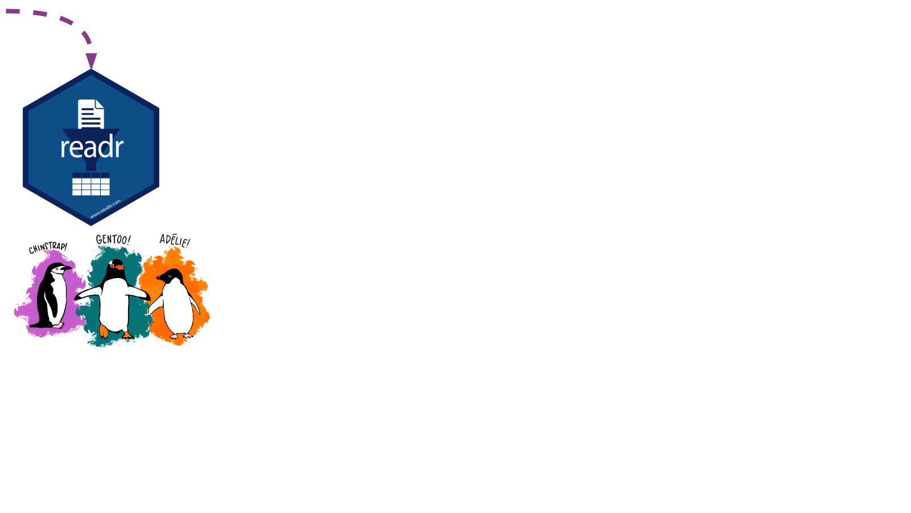{.absolute top=30 left=30 width="100%" fig-alt="Our illustrated penguins are starting their tour with the readr package! The photo backdrop is a snowy Antarctic wonderland featuring a Gentoo penguin with outstretched flippers"}

::: footer
<span>Photo by <a href="https://unsplash.com/@eadesstudio?utm_source=unsplash&amp;utm_medium=referral&amp;utm_content=creditCopyText">James Eades</a> on <a href="https://unsplash.com/collections/12240655/palmerpenguins/d5aed8c855e26061e5e651d3f180b76d?utm_source=unsplash&amp;utm_medium=referral&amp;utm_content=creditCopyText">Unsplash</a></span>
:::

---

## readr: info {background-image="images/hex/readr.png" background-size="8%" background-position="98% 4%"}

<!--start panels-->
::: {.panel-tabset}

### Overview

<br><br>

<!--start columns-->
:::: {.columns}

::: {.column width="50%"}
### Importing data is the very first step!

You can use `readr` to import rectangular data.
:::

::: {.column width="50%"}
### You can import...

- comma separated (CSV) files with `read_csv()`
- tab separated files with `read_tsv()`
- general delimited files with `read_delim()`
- fixed width files with `read_fwf()`
- tabular files where columns are separated by white-space with `read_table()`
- web log files with `read_log()` 
:::

::::
<!--end columns-->

### Cheatsheet

 PDF: <https://github.com/rstudio/cheatsheets/raw/main/data-import.pdf>
{fig-alt="Screenshot of readr cheatsheet"}

### Reading

<!--start columns-->
:::: {.columns}

::: {.column width="40%"}

{width="300" fig-alt="R4DS book cover"}

:::

::: {.column width="60%"}

<br>

### R for Data Science: [Ch 11 Data import](https://r4ds.had.co.nz/data-import.html)

### Package documentation: <https://readr.tidyverse.org>
:::

::::
<!--end columns-->

::: 
<!--end panels-->

## readr: exercise {background-image="images/hex/readr.png" background-size="8%" background-position="98% 4%"}

<!--start panels-->
::: {.panel-tabset}

### Read data in

#### Options 1 & 2 below will get you the same raw dataset for Adélie penguins. Try it out! {.center-x}

Option 1: load using URL

::: {.cell}

```{.r .cell-code}
read_csv("https://portal.edirepository.org/nis/dataviewer?packageid=knb-lter-pal.219.3&entityid=002f3893385f710df69eeebe893144ff")
```
:::

<br>
Option 2: load using filepath

::: {.cell}

```{.r .cell-code}
read_csv("tutorial/raw_adelie.csv")
```
:::

<br>

----

Option 3: Lucky for us, the `palmerpenguins` 📦 compiles data from all three species together! Check the clean data and raw data tabs to learn more.

### Clean data

`penguins` contains a clean dataset

::: {.cell}

```{.r .cell-code}
penguins <- palmerpenguins::penguins
penguins
```

::: {.cell-output .cell-output-stdout}
```
# A tibble: 344 × 8
   species island    bill_length_mm bill_depth_mm flipper_…¹ body_…² sex    year
   <fct>   <fct>              <dbl>         <dbl>      <int>   <int> <fct> <int>
 1 Adelie  Torgersen           39.1          18.7        181    3750 male   2007
 2 Adelie  Torgersen           39.5          17.4        186    3800 fema…  2007
 3 Adelie  Torgersen           40.3          18          195    3250 fema…  2007
 4 Adelie  Torgersen           NA            NA           NA      NA <NA>   2007
 5 Adelie  Torgersen           36.7          19.3        193    3450 fema…  2007
 6 Adelie  Torgersen           39.3          20.6        190    3650 male   2007
 7 Adelie  Torgersen           38.9          17.8        181    3625 fema…  2007
 8 Adelie  Torgersen           39.2          19.6        195    4675 male   2007
 9 Adelie  Torgersen           34.1          18.1        193    3475 <NA>   2007
10 Adelie  Torgersen           42            20.2        190    4250 <NA>   2007
# … with 334 more rows, and abbreviated variable names ¹​flipper_length_mm,
#   ²​body_mass_g
```
:::
:::


### Raw data

`penguins_raw` contains the raw data

::: {.cell}

```{.r .cell-code}
palmerpenguins::penguins_raw
```

::: {.cell-output .cell-output-stdout}
```
# A tibble: 344 × 17
   studyName Sample Num…¹ Species Region Island Stage Indiv…² Clutc…³ `Date Egg`
   <chr>            <dbl> <chr>   <chr>  <chr>  <chr> <chr>   <chr>   <date>    
 1 PAL0708              1 Adelie… Anvers Torge… Adul… N1A1    Yes     2007-11-11
 2 PAL0708              2 Adelie… Anvers Torge… Adul… N1A2    Yes     2007-11-11
 3 PAL0708              3 Adelie… Anvers Torge… Adul… N2A1    Yes     2007-11-16
 4 PAL0708              4 Adelie… Anvers Torge… Adul… N2A2    Yes     2007-11-16
 5 PAL0708              5 Adelie… Anvers Torge… Adul… N3A1    Yes     2007-11-16
 6 PAL0708              6 Adelie… Anvers Torge… Adul… N3A2    Yes     2007-11-16
 7 PAL0708              7 Adelie… Anvers Torge… Adul… N4A1    No      2007-11-15
 8 PAL0708              8 Adelie… Anvers Torge… Adul… N4A2    No      2007-11-15
 9 PAL0708              9 Adelie… Anvers Torge… Adul… N5A1    Yes     2007-11-09
10 PAL0708             10 Adelie… Anvers Torge… Adul… N5A2    Yes     2007-11-09
# … with 334 more rows, 8 more variables: `Culmen Length (mm)` <dbl>,
#   `Culmen Depth (mm)` <dbl>, `Flipper Length (mm)` <dbl>,
#   `Body Mass (g)` <dbl>, Sex <chr>, `Delta 15 N (o/oo)` <dbl>,
#   `Delta 13 C (o/oo)` <dbl>, Comments <chr>, and abbreviated variable names
#   ¹​`Sample Number`, ²​`Individual ID`, ³​`Clutch Completion`
```
:::
:::

:::
<!--end panels-->


# 02-tibble {visibility="hidden"}


## {background-image="https://images.unsplash.com/photo-1591792111137-5b8219d5fad6?ixlib=rb-1.2.1&ixid=eyJhcHBfaWQiOjEyMDd9&auto=format&fit=crop&w=4350&q=80" background-position="52% 5%" background-size="cover"}

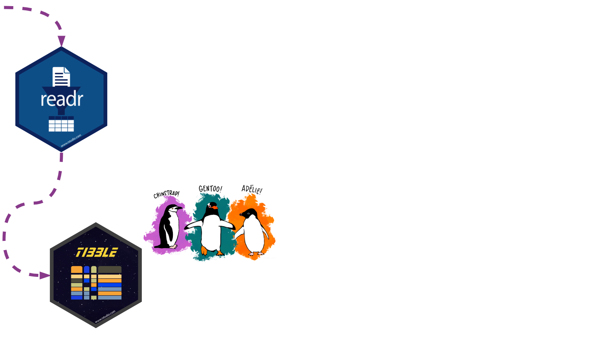{.absolute top=30 left=30 width="100%" fig-alt="Our illustrated penguins have reached the tibble package! The photo backdrop is a snowy Antarctic wonderland featuring a Gentoo penguin with outstretched flippers"}

::: footer
<span>Photo by <a href="https://unsplash.com/@eadesstudio?utm_source=unsplash&amp;utm_medium=referral&amp;utm_content=creditCopyText">James Eades</a> on <a href="https://unsplash.com/collections/12240655/palmerpenguins/d5aed8c855e26061e5e651d3f180b76d?utm_source=unsplash&amp;utm_medium=referral&amp;utm_content=creditCopyText">Unsplash</a></span>
:::

---

## tibble: info {background-image="images/hex/tibble.png" background-size="8%" background-position="98% 4%"}

<!--start panels-->
::: {.panel-tabset}

### Overview {.center}

<br><br>

#### A `tibble` is much like the `dataframe` in base R,<br>but optimized for use in the Tidyverse.{.center}


### Cheatsheet

 PDF: <https://github.com/rstudio/cheatsheets/blob/main/tidyr.pdf>
{width=65% fig-alt="The tibble package shares a cheatsheet with the tidyr package"}

### Reading

<!--start columns-->
:::: {.columns}

::: {.column width="40%"}

{width="300" fig-alt="R4DS book cover"}

:::

::: {.column width="60%"}

<br>

### R for Data Science: [Ch 10 Tibbles](https://r4ds.had.co.nz/tibbles.html)

### Package documentation: <https://tibble.tidyverse.org>
:::

::::
<!--end columns-->

::: 
<!--end panels-->

## tibble: exercise {background-image="images/hex/tibble.png" background-size="8%" background-position="98% 4%"}

<!--start panels-->
::: {.panel-tabset}

### Code

#### Let's take a look at the differences! {.center-x}

::: {.cell}

```{.r .cell-code}
# try each of these commands in the console and see if 
# you can spot the differences!

as_tibble(penguins)
as.data.frame(penguins)
```
:::

### Result


::: {.cell}

```{.r .cell-code}
as_tibble(penguins) |> head(4)
```

::: {.cell-output .cell-output-stdout}
```
# A tibble: 4 × 8
  species island    bill_length_mm bill_depth_mm flipper_l…¹ body_…² sex    year
  <fct>   <fct>              <dbl>         <dbl>       <int>   <int> <fct> <int>
1 Adelie  Torgersen           39.1          18.7         181    3750 male   2007
2 Adelie  Torgersen           39.5          17.4         186    3800 fema…  2007
3 Adelie  Torgersen           40.3          18           195    3250 fema…  2007
4 Adelie  Torgersen           NA            NA            NA      NA <NA>   2007
# … with abbreviated variable names ¹​flipper_length_mm, ²​body_mass_g
```
:::
:::

<br>

::: {.cell}

```{.r .cell-code}
as.data.frame(penguins) |> head(4)
```

::: {.cell-output .cell-output-stdout}
```
  species    island bill_length_mm bill_depth_mm flipper_length_mm body_mass_g
1  Adelie Torgersen           39.1          18.7               181        3750
2  Adelie Torgersen           39.5          17.4               186        3800
3  Adelie Torgersen           40.3          18.0               195        3250
4  Adelie Torgersen             NA            NA                NA          NA
     sex year
1   male 2007
2 female 2007
3 female 2007
4   <NA> 2007
```
:::
:::

### Chat

#### What differences do you see?

You might see a `tibble` prints:

- variable classes
- only 10 rows
- only as many columns as can fit on the screen
- `NA`s are highlighted in console so they're easy to spot (font highlighting and styling in `tibble`)

Not so much a concern in an R Markdown file, but noticeable in the console

This enhanced print method makes it easier to work with large datasets

### More

There are a couple of other main differences, namely in **subsetting** and **recycling**

Check them out in [`vignette("tibble")`](https://tibble.tidyverse.org/articles/tibble.html)

::: {.cell}

```{.r .cell-code}
vignette("tibble")
```
:::

:::
<!--end panels-->


# 03-ggplot2 {visibility="hidden"}


## {background-image="https://images.unsplash.com/photo-1591792111137-5b8219d5fad6?ixlib=rb-1.2.1&ixid=eyJhcHBfaWQiOjEyMDd9&auto=format&fit=crop&w=4350&q=80" background-position="52% 5%" background-size="cover"}

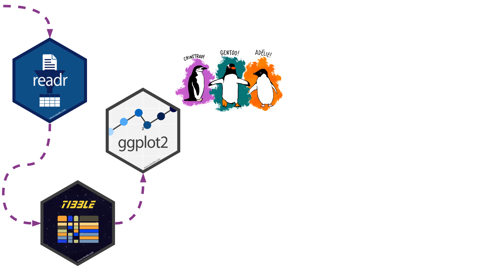{.absolute top=30 left=30 width="100%" fig-alt="Our illustrated penguins have reached the ggplot2 package! The photo backdrop is a snowy Antarctic wonderland featuring a Gentoo penguin with outstretched flippers"}

::: footer
<span>Photo by <a href="https://unsplash.com/@eadesstudio?utm_source=unsplash&amp;utm_medium=referral&amp;utm_content=creditCopyText">James Eades</a> on <a href="https://unsplash.com/collections/12240655/palmerpenguins/d5aed8c855e26061e5e651d3f180b76d?utm_source=unsplash&amp;utm_medium=referral&amp;utm_content=creditCopyText">Unsplash</a></span>
:::

---

## ggplot2: info {background-image="images/hex/ggplot2.png" background-size="8%" background-position="98% 4%"}

<!--start panels-->
::: {.panel-tabset}

### Overview {.center}

<br><br>

#### `ggplot2` uses the "Grammar of Graphics" and layers graphical components together to help us create a plot

Let's start by making a simple plot of our data!


### Cheatsheet

 PDF: <https://github.com/rstudio/cheatsheets/raw/main/data-visualization-2.1.pdf>
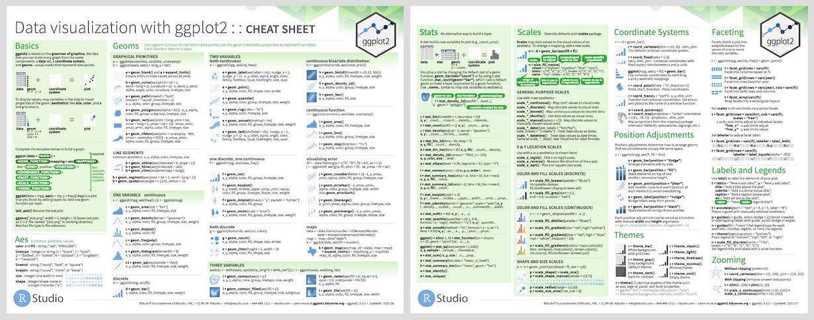{width=100% fig-alt="ggplot2 cheatsheet"}

### Reading

<!--start columns-->
:::: {.columns}

::: {.column width="40%"}

{width="300" fig-alt="R4DS book cover"}

:::

::: {.column width="60%"}

<br>

### R for Data Science: [Ch 3 Data visualization](https://r4ds.had.co.nz/data-visualisation.html)

### Package documentation: <https://ggplot2.tidyverse.org>
:::

::::
<!--end columns-->

::: 
<!--end panels-->

## ggplot2: exercise {background-image="images/hex/ggplot2.png" background-size="8%" background-position="98% 4%"}

<!--start panels-->
::: {.panel-tabset}

### View the data

Get a full view of the dataset:

::: {.cell}

```{.r .cell-code}
View(penguins)
```
:::

<br>
Or catch a `glimpse`:

::: {.cell}

```{.r .cell-code}
glimpse(penguins)
```

::: {.cell-output .cell-output-stdout}
```
Rows: 344
Columns: 8
$ species           <fct> Adelie, Adelie, Adelie, Adelie, Adelie, Adelie, Adel…
$ island            <fct> Torgersen, Torgersen, Torgersen, Torgersen, Torgerse…
$ bill_length_mm    <dbl> 39.1, 39.5, 40.3, NA, 36.7, 39.3, 38.9, 39.2, 34.1, …
$ bill_depth_mm     <dbl> 18.7, 17.4, 18.0, NA, 19.3, 20.6, 17.8, 19.6, 18.1, …
$ flipper_length_mm <int> 181, 186, 195, NA, 193, 190, 181, 195, 193, 190, 186…
$ body_mass_g       <int> 3750, 3800, 3250, NA, 3450, 3650, 3625, 4675, 3475, …
$ sex               <fct> male, female, female, NA, female, male, female, male…
$ year              <int> 2007, 2007, 2007, 2007, 2007, 2007, 2007, 2007, 2007…
```
:::
:::

### Scatterplot

Let's see if body mass varies by penguin sex using `geom_point()`

::: {.cell}

```{.r .cell-code}
ggplot(data = penguins, aes(x = sex, y = body_mass_g)) + 
  geom_point()
```

::: {.cell-output-display}
{fig-alt='A scatterplot with categorical penguin sex along the x axis and continuous body mass along the y axis. The three sex categories are female, male, and NA. The body mass appears to range between 2400g and 6500g. Because this is a scatterplot, there are various points scattered along the y axis in a line above each sex category, which doesn\'t tell us much about these data. There are other types of plots better suited for visualizing the relationship between a continuous variable and a categorical variable.' width=960}
:::
:::

### Boxplot

Let's see if body mass varies by penguin sex, this time with `geom_boxplot()`

::: {.cell}

```{.r .cell-code  code-line-numbers="2"}
ggplot(data = penguins, aes(x = sex, y = body_mass_g)) +
  geom_boxplot()
```

::: {.cell-output-display}
{fig-alt='A boxplot with penguin sex along the x axis and body mass along the y axis. Again, the three sex categories are female, male, and NA, and the body mass appears to range between 2400g and 6500g. Because this is a boxplot, we can visualize the minimum value, first quartile, median, third quartile, and maximum value of penguin body mass, for each penguin sex category. Female penguins have a lower median body mass than male penguins, while the NA sex category is somewhere in between the two. There are no outliers.' width=960}
:::
:::

### By Species

Let's see if body mass varies by penguin sex, and now fill the boxplots <br>according to penguin species

::: {.cell}

```{.r .cell-code  code-line-numbers="2"}
ggplot(data = penguins, aes(x = sex, y = body_mass_g)) +
  geom_boxplot(aes(fill = species))
```

::: {.cell-output-display}
{fig-alt='A boxplot with penguin sex along the x axis and body mass along the y axis. Again, the three sex categories are female, male, and NA, and the body mass appears to range between 2400g and 6500g. This time, instead of one boxplot per sex category, there is a boxplot for each species, per sex category, and these are filled with different colors. Gentoo boxplots are blue, Adélie boxplots are reddish, and Chinstrap boxplots are green. Male penguins have higher body mass across species, and Gentoo penguins stand out as having higher body mass than both Chinstrap and Adélie penguins. Low body mass outliers exist for female Chinstrap penguins and NA Gentoo penguins, and high body mass outliers exist for male Chinstrap penguins. There is no boxplot for Chinstrap penguins in the NA sex category.' width=960}
:::
:::

### Chat

#### The boxplot filled by species helps us see...

- Gentoo penguins have higher body mass than Adélie and Chinstrap penguins
- Higher body mass among male Gentoo penguins compared to female penguins
- Pattern not as discernible when comparing Adélie and Chinstrap penguins
- No `NA`s among Chinstrap penguin data points! **sex** was available for each observation


::: {.cell}
::: {.cell-output-display}
{fig-alt='Same boxplot as the previous tab. Any additional data insights are listed in the text of this slide.' width=960}
:::
:::

:::
<!--end panels-->


# 04-dplyr {visibility="hidden"}


## {background-image="https://images.unsplash.com/photo-1591792111137-5b8219d5fad6?ixlib=rb-1.2.1&ixid=eyJhcHBfaWQiOjEyMDd9&auto=format&fit=crop&w=4350&q=80" background-position="52% 5%" background-size="cover"}

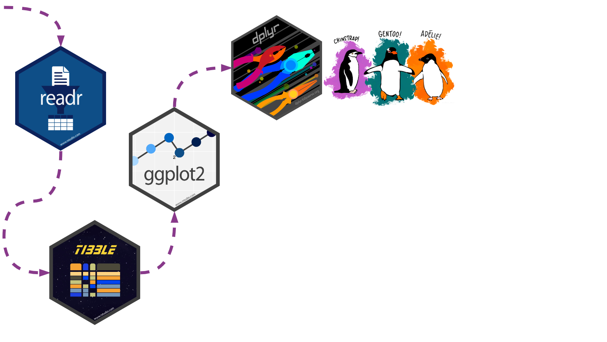{.absolute top=30 left=30 width="100%" fig-alt="Our illustrated penguins have reached the dplyr package! The photo backdrop is a snowy Antarctic wonderland featuring a Gentoo penguin with outstretched flippers"}

::: footer
<span>Photo by <a href="https://unsplash.com/@eadesstudio?utm_source=unsplash&amp;utm_medium=referral&amp;utm_content=creditCopyText">James Eades</a> on <a href="https://unsplash.com/collections/12240655/palmerpenguins/d5aed8c855e26061e5e651d3f180b76d?utm_source=unsplash&amp;utm_medium=referral&amp;utm_content=creditCopyText">Unsplash</a></span>
:::

---

## dplyr: info {background-image="images/hex/dplyr.png" background-size="8%" background-position="98% 4%"}

<!--start panels-->
::: {.panel-tabset}

### Overview {.center}

:::: {.columns}

::: {.column}

#### Data transformation helps you get the data in exactly the right form you need 

With `dplyr` you can:

- create new variables
- create summaries
- rename variables
- reorder observations
- ...and more!

:::

::: {.column}

- Pick observations by their values with `filter()`.
- Reorder the rows with `arrange()`.
- Pick variables by their names `select()`.
- Create new variables with functions of existing variables with `mutate()`.
- Collapse many values down to a single summary with `summarize()`.
- `group_by()` gets the above functions to operate group-by-group rather than on the entire dataset. 
- and `count()` + `add_count()` simplify `group_by()` + `summarize()` when you just want to count

:::

::::
<!--end columns-->

### Cheatsheet

 PDF: <https://github.com/rstudio/cheatsheets/raw/main/data-transformation.pdf>
{width=100% fig-alt="dplyr cheatsheet"}

### Reading

<!--start columns-->
:::: {.columns}

::: {.column width="40%"}

{width="300" fig-alt="R4DS book cover"}

:::

::: {.column width="60%"}

<br>

### R for Data Science: [Ch 11 Data transformation](https://r4ds.had.co.nz/transform.html)

### Package documentation: <https://dplyr.tidyverse.org>
:::

::::
<!--end columns-->

::: 
<!--end panels-->

## dplyr: exercise {background-image="images/hex/dplyr.png" background-size="8%" background-position="98% 4%"}

<!--start panels-->
::: {.panel-tabset}

### Select

#### Can you spot the difference in these operations?{.center-x}

:::: {.columns}

::: {.column}

::: {.cell}

```{.r .cell-code}
select(penguins, 
       species,
       sex,
       body_mass_g)
```

::: {.cell-output .cell-output-stdout}
```
# A tibble: 344 × 3
   species sex    body_mass_g
   <fct>   <fct>        <int>
 1 Adelie  male          3750
 2 Adelie  female        3800
 3 Adelie  female        3250
 4 Adelie  <NA>            NA
 5 Adelie  female        3450
 6 Adelie  male          3650
 7 Adelie  female        3625
 8 Adelie  male          4675
 9 Adelie  <NA>          3475
10 Adelie  <NA>          4250
# … with 334 more rows
```
:::
:::

:::

::: {.column}

::: {.cell}

```{.r .cell-code}
penguins |> 
  select(species,
         sex,
         body_mass_g)
```

::: {.cell-output .cell-output-stdout}
```
# A tibble: 344 × 3
   species sex    body_mass_g
   <fct>   <fct>        <int>
 1 Adelie  male          3750
 2 Adelie  female        3800
 3 Adelie  female        3250
 4 Adelie  <NA>            NA
 5 Adelie  female        3450
 6 Adelie  male          3650
 7 Adelie  female        3625
 8 Adelie  male          4675
 9 Adelie  <NA>          3475
10 Adelie  <NA>          4250
# … with 334 more rows
```
:::
:::

:::

::::
<!--end columns-->

### Arrange

We can use `arrange()` to arrange our data in descending order by **body_mass_g**

:::: {.columns}

::: {.column width=45%}

::: {.cell}

```{.r .cell-code}
glimpse(penguins)
## Rows: 344
## Columns: 8
## $ species           <fct> Adelie, Adelie, Adelie, Adelie, Adelie, Adelie, Adel…
## $ island            <fct> Torgersen, Torgersen, Torgersen, Torgersen, Torgerse…
## $ bill_length_mm    <dbl> 39.1, 39.5, 40.3, NA, 36.7, 39.3, 38.9, 39.2, 34.1, …
## $ bill_depth_mm     <dbl> 18.7, 17.4, 18.0, NA, 19.3, 20.6, 17.8, 19.6, 18.1, …
## $ flipper_length_mm <int> 181, 186, 195, NA, 193, 190, 181, 195, 193, 190, 186…
## $ body_mass_g       <int> 3750, 3800, 3250, NA, 3450, 3650, 3625, 4675, 3475, …
## $ sex               <fct> male, female, female, NA, female, male, female, male…
## $ year              <int> 2007, 2007, 2007, 2007, 2007, 2007, 2007, 2007, 2007…
```
:::

:::

::: {.column width=55%}

::: {.cell}

```{.r .cell-code  code-line-numbers="3"}
penguins |>
  select(species, sex, body_mass_g) |>
  arrange(desc(body_mass_g))
```

::: {.cell-output .cell-output-stdout}
```
# A tibble: 344 × 3
   species sex   body_mass_g
   <fct>   <fct>       <int>
 1 Gentoo  male         6300
 2 Gentoo  male         6050
 3 Gentoo  male         6000
 4 Gentoo  male         6000
 5 Gentoo  male         5950
 6 Gentoo  male         5950
 7 Gentoo  male         5850
 8 Gentoo  male         5850
 9 Gentoo  male         5850
10 Gentoo  male         5800
# … with 334 more rows
```
:::
:::

:::

::::
<!--end columns-->

### Group By & Summarize

:::: {.columns}

::: {.column width=45%}

We can use `group_by()` to group our data by **species** and **sex**

We can use `summarize()` to calculate the average **body_mass_g** for each grouping

:::

::: {.column width=55%}
::: {.cell}

```{.r .cell-code  code-line-numbers="3|4"}
penguins |>
  select(species, sex, body_mass_g) |>
  group_by(species, sex) |>         
  summarize(mean = mean(body_mass_g))
```

::: {.cell-output .cell-output-stdout}
```
# A tibble: 8 × 3
# Groups:   species [3]
  species   sex     mean
  <fct>     <fct>  <dbl>
1 Adelie    female 3369.
2 Adelie    male   4043.
3 Adelie    <NA>     NA 
4 Chinstrap female 3527.
5 Chinstrap male   3939.
6 Gentoo    female 4680.
7 Gentoo    male   5485.
8 Gentoo    <NA>     NA 
```
:::
:::

:::

::::
<!--end columns-->

### Count 1

If we're just interested in _counting_ the observations in each grouping, we can group and summarize with special functions `count()` and `add_count()`.

----

:::: {.columns}

::: {.column width=45%}

Counting can be done with `group_by()` and `summarize()`, but it's a little cumbersome. 

It involves...

1. using `mutate()` to create an intermediate variable **n_species** that adds up all observations per **species**, and
1. an `ungroup()`-ing step

:::

::: {.column width=55%}

::: {.cell}

```{.r .cell-code  code-line-numbers="3-4"}
penguins |> 
  group_by(species) |>
  mutate(n_species = n()) |> 
  ungroup() |> 
  group_by(species, sex, n_species) |>
  summarize(n = n())
```

::: {.cell-output .cell-output-stdout}
```
# A tibble: 8 × 4
# Groups:   species, sex [8]
  species   sex    n_species     n
  <fct>     <fct>      <int> <int>
1 Adelie    female       152    73
2 Adelie    male         152    73
3 Adelie    <NA>         152     6
4 Chinstrap female        68    34
5 Chinstrap male          68    34
6 Gentoo    female       124    58
7 Gentoo    male         124    61
8 Gentoo    <NA>         124     5
```
:::
:::

:::

::::
<!--end columns-->

### Count 2

If we're just interested in _counting_ the observations in each grouping, we can group and summarize with special functions `count()` and `add_count()`.

----

:::: {.columns}

::: {.column width=45%}

In contrast, `count()` and `add_count()` offer a simplified approach

::: {.small-text}
Example kindly [contributed by Alison Hill](https://github.com/spcanelon/2020-rladies-chi-tidyverse/issues/2)
:::

:::

::: {.column width=55%}

::: {.cell}

```{.r .cell-code  code-line-numbers="3-4"}
penguins |>
  count(species, sex) |>
  add_count(species, wt = n, 
            name = "n_species")
```

::: {.cell-output .cell-output-stdout}
```
# A tibble: 8 × 4
  species   sex        n n_species
  <fct>     <fct>  <int>     <int>
1 Adelie    female    73       152
2 Adelie    male      73       152
3 Adelie    <NA>       6       152
4 Chinstrap female    34        68
5 Chinstrap male      34        68
6 Gentoo    female    58       124
7 Gentoo    male      61       124
8 Gentoo    <NA>       5       124
```
:::
:::

:::

::::
<!--end columns-->

### Mutate

:::: {.columns}

::: {.column width=45%}
We can add to our counting example by using `mutate()` to create a new variable **prop**

**prop** represents the proportion of penguins of each **sex**, grouped by **species**

::: {.small-text}

Example kindly [contributed by Alison Hill](https://github.com/spcanelon/2020-rladies-chi-tidyverse/issues/2)

:::

:::

::: {.column width=55%}
::: {.cell}

```{.r .cell-code  code-line-numbers="5"}
penguins |>
  count(species, sex) |>
  add_count(species, wt = n, 
            name = "n_species") |>
  mutate(prop = n/n_species*100)
```

::: {.cell-output .cell-output-stdout}
```
# A tibble: 8 × 5
  species   sex        n n_species  prop
  <fct>     <fct>  <int>     <int> <dbl>
1 Adelie    female    73       152 48.0 
2 Adelie    male      73       152 48.0 
3 Adelie    <NA>       6       152  3.95
4 Chinstrap female    34        68 50   
5 Chinstrap male      34        68 50   
6 Gentoo    female    58       124 46.8 
7 Gentoo    male      61       124 49.2 
8 Gentoo    <NA>       5       124  4.03
```
:::
:::

:::

::::
<!--end columns-->

### Filter

:::: {.columns}

::: {.column width=45%}

Finally, we can filter rows to only show us **Chinstrap** penguin summaries by adding `filter()` to our pipeline

:::

::: {.column width=55%}

::: {.cell}

```{.r .cell-code  code-line-numbers="6"}
penguins |>
  count(species, sex) |>
  add_count(species, wt = n, 
            name = "n_species") |>
  mutate(prop = n/n_species*100) |>
  filter(species == "Chinstrap")
```

::: {.cell-output .cell-output-stdout}
```
# A tibble: 2 × 5
  species   sex        n n_species  prop
  <fct>     <fct>  <int>     <int> <dbl>
1 Chinstrap female    34        68    50
2 Chinstrap male      34        68    50
```
:::
:::

:::

::::
<!--end columns-->

:::
<!--end panels-->


# 05-forcats {visibility="hidden"}


## {background-image="https://images.unsplash.com/photo-1591792111137-5b8219d5fad6?ixlib=rb-1.2.1&ixid=eyJhcHBfaWQiOjEyMDd9&auto=format&fit=crop&w=4350&q=80" background-position="52% 5%" background-size="cover"}

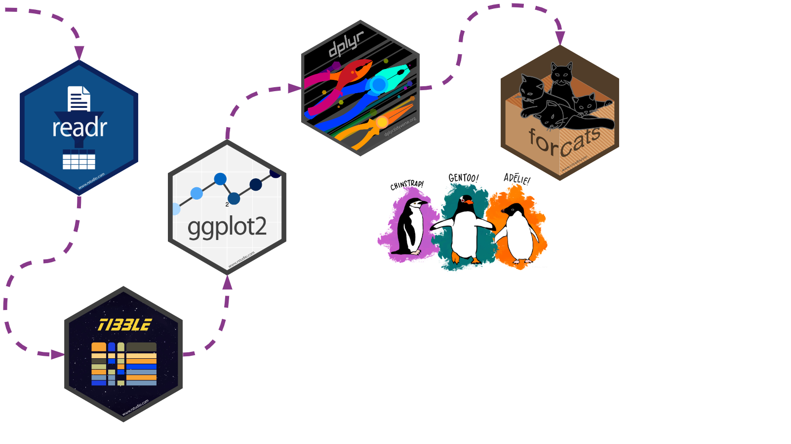{.absolute top=30 left=30 width="100%" fig-alt="Our illustrated penguins have reached the forcats package! The photo backdrop is a snowy Antarctic wonderland featuring a Gentoo penguin with outstretched flippers"}

::: footer
<span>Photo by <a href="https://unsplash.com/@eadesstudio?utm_source=unsplash&amp;utm_medium=referral&amp;utm_content=creditCopyText">James Eades</a> on <a href="https://unsplash.com/collections/12240655/palmerpenguins/d5aed8c855e26061e5e651d3f180b76d?utm_source=unsplash&amp;utm_medium=referral&amp;utm_content=creditCopyText">Unsplash</a></span>
:::

---

## forcats: info {background-image="images/hex/forcats.png" background-size="8%" background-position="98% 4%"}

<!--start panels-->
::: {.panel-tabset}

### Overview {.center}

<br><br>

#### `forcats` helps us work with **categorical variables** or factors 

These are variables that have a fixed and known set of possible values, like **species**, **island**, and **sex** in our `penguins` dataset


### Cheatsheet

 <https://github.com/rstudio/cheatsheets/raw/main/factors.pdf>
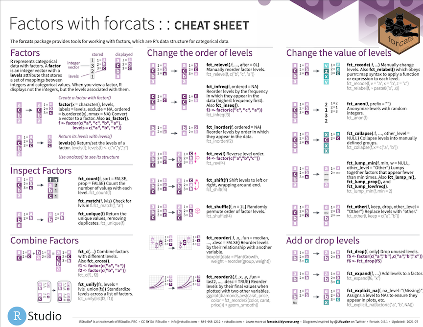{width=60% fig-alt="forcats cheatsheet"}

### Reading

<!--start columns-->
:::: {.columns}

::: {.column width="40%"}

{width="300" fig-alt="R4DS book cover"}

:::

::: {.column width="60%"}

<br>

#### R for Data Science: [Ch 15 Factors](https://r4ds.had.co.nz/factors.html)

#### Package documentation: <https://forcats.tidyverse.org>

:::

::::
<!--end columns-->

::: 
<!--end panels-->

## forcats: exercise {background-image="images/hex/forcats.png" background-size="8%" background-position="98% 4%"}

<!--start panels-->
::: {.panel-tabset}

### Code

Currently the **year** variable in `penguins` is continuous from 2007 to 2009

Usually this isn't what we want and we might want to turn it into a categorical variable instead

The `factor()` function is perfect for this

::: {.cell}

```{.r .cell-code}
penguins |> mutate(year_factor = factor(year, levels = unique(year)))
```

::: {.cell-output .cell-output-stdout}
```
# A tibble: 344 × 9
   species island    bill_length_mm bill_d…¹ flipp…² body_…³ sex    year year_…⁴
   <fct>   <fct>              <dbl>    <dbl>   <int>   <int> <fct> <int> <fct>  
 1 Adelie  Torgersen           39.1     18.7     181    3750 male   2007 2007   
 2 Adelie  Torgersen           39.5     17.4     186    3800 fema…  2007 2007   
 3 Adelie  Torgersen           40.3     18       195    3250 fema…  2007 2007   
 4 Adelie  Torgersen           NA       NA        NA      NA <NA>   2007 2007   
 5 Adelie  Torgersen           36.7     19.3     193    3450 fema…  2007 2007   
 6 Adelie  Torgersen           39.3     20.6     190    3650 male   2007 2007   
 7 Adelie  Torgersen           38.9     17.8     181    3625 fema…  2007 2007   
 8 Adelie  Torgersen           39.2     19.6     195    4675 male   2007 2007   
 9 Adelie  Torgersen           34.1     18.1     193    3475 <NA>   2007 2007   
10 Adelie  Torgersen           42       20.2     190    4250 <NA>   2007 2007   
# … with 334 more rows, and abbreviated variable names ¹​bill_depth_mm,
#   ²​flipper_length_mm, ³​body_mass_g, ⁴​year_factor
```
:::
:::

### Result

The result is a new variable **year_factor** with factor levels **2007**, **2008**, and **2009**

::: {.cell}

```{.r .cell-code}
penguins_new <- penguins |> mutate(year_factor = factor(year, levels = unique(year)))
penguins_new |> head()
```

::: {.cell-output .cell-output-stdout}
```
# A tibble: 6 × 9
  species island    bill_length_mm bill_de…¹ flipp…² body_…³ sex    year year_…⁴
  <fct>   <fct>              <dbl>     <dbl>   <int>   <int> <fct> <int> <fct>  
1 Adelie  Torgersen           39.1      18.7     181    3750 male   2007 2007   
2 Adelie  Torgersen           39.5      17.4     186    3800 fema…  2007 2007   
3 Adelie  Torgersen           40.3      18       195    3250 fema…  2007 2007   
4 Adelie  Torgersen           NA        NA        NA      NA <NA>   2007 2007   
5 Adelie  Torgersen           36.7      19.3     193    3450 fema…  2007 2007   
6 Adelie  Torgersen           39.3      20.6     190    3650 male   2007 2007   
# … with abbreviated variable names ¹​bill_depth_mm, ²​flipper_length_mm,
#   ³​body_mass_g, ⁴​year_factor
```
:::
:::

:::: {.columns}

::: {.column width=50%}

::: {.cell}

```{.r .cell-code}
class(penguins_new$year_factor)
```

::: {.cell-output .cell-output-stdout}
```
[1] "factor"
```
:::
:::

:::

::: {.column width=50%}

::: {.cell}

```{.r .cell-code}
levels(penguins_new$year_factor)
```

::: {.cell-output .cell-output-stdout}
```
[1] "2007" "2008" "2009"
```
:::
:::

:::

::::
<!--end columns-->

:::
<!--end panels-->


# 06-stringr {visibility="hidden"}


## {background-image="https://images.unsplash.com/photo-1591792111137-5b8219d5fad6?ixlib=rb-1.2.1&ixid=eyJhcHBfaWQiOjEyMDd9&auto=format&fit=crop&w=4350&q=80" background-position="52% 5%" background-size="cover"}

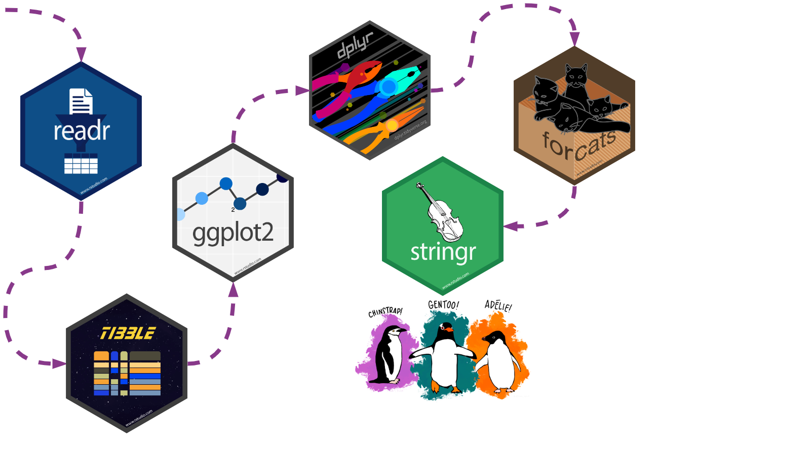{.absolute top=30 left=30 width="100%" fig-alt="Our illustrated penguins have reached the stringr package! The photo backdrop is a snowy Antarctic wonderland featuring a Gentoo penguin with outstretched flippers"}

::: footer
<span>Photo by <a href="https://unsplash.com/@eadesstudio?utm_source=unsplash&amp;utm_medium=referral&amp;utm_content=creditCopyText">James Eades</a> on <a href="https://unsplash.com/collections/12240655/palmerpenguins/d5aed8c855e26061e5e651d3f180b76d?utm_source=unsplash&amp;utm_medium=referral&amp;utm_content=creditCopyText">Unsplash</a></span>
:::

---

## stringr: info {background-image="images/hex/stringr.png" background-size="8%" background-position="98% 4%"}

<!--start panels-->
::: {.panel-tabset}

### Overview {.center}

<br>

:::: {.columns}

::: {.column width=48%}

#### `stringr` helps us manipulate strings! 

The package includes many functions to help us with **regular expressions**, which are a concise language for describing patterns in strings.

:::

::: {.column width=50%}
 
### These functions help us

-  detect matches
-  subset strings
-  manage string lengths
-  mutate strings
-  join and split strings
-  order strings
-  ...and more!

:::

::::

### Cheatsheet

 PDF: <https://github.com/rstudio/cheatsheets/raw/main/strings.pdf>
{fig-alt="stringr cheatsheet"}

### Reading

<!--start columns-->
:::: {.columns}

::: {.column width="40%"}

{width="300" fig-alt="R4DS book cover"}

:::

::: {.column width="60%"}

<br><br>

#### R for Data Science: [Ch 14 Strings](https://r4ds.had.co.nz/strings.html)

#### Package documentation: <https://stringr.tidyverse.org>

:::

::::
<!--end columns-->

::: 
<!--end panels-->

## stringr: exercise {background-image="images/hex/stringr.png" background-size="8%" background-position="98% 4%"}

<!--start panels-->
::: {.panel-tabset}

### Mutate

#### What does this chunk do?
::: {.cell}

```{.r .cell-code  code-line-numbers="3"}
penguins |>
  select(species, island) |>
  mutate(ISLAND = str_to_upper(island))
```

::: {.cell-output .cell-output-stdout}
```
# A tibble: 344 × 3
   species island    ISLAND   
   <fct>   <fct>     <chr>    
 1 Adelie  Torgersen TORGERSEN
 2 Adelie  Torgersen TORGERSEN
 3 Adelie  Torgersen TORGERSEN
 4 Adelie  Torgersen TORGERSEN
 5 Adelie  Torgersen TORGERSEN
 6 Adelie  Torgersen TORGERSEN
 7 Adelie  Torgersen TORGERSEN
 8 Adelie  Torgersen TORGERSEN
 9 Adelie  Torgersen TORGERSEN
10 Adelie  Torgersen TORGERSEN
# … with 334 more rows
```
:::
:::

### Join

#### How about this one?
::: {.cell}

```{.r .cell-code  code-line-numbers="4"}
penguins |>
  select(species, island) |>
  mutate(ISLAND = str_to_upper(island)) |>
  mutate(species_island = str_c(species, ISLAND, sep = "_"))
```

::: {.cell-output .cell-output-stdout}
```
# A tibble: 344 × 4
   species island    ISLAND    species_island  
   <fct>   <fct>     <chr>     <chr>           
 1 Adelie  Torgersen TORGERSEN Adelie_TORGERSEN
 2 Adelie  Torgersen TORGERSEN Adelie_TORGERSEN
 3 Adelie  Torgersen TORGERSEN Adelie_TORGERSEN
 4 Adelie  Torgersen TORGERSEN Adelie_TORGERSEN
 5 Adelie  Torgersen TORGERSEN Adelie_TORGERSEN
 6 Adelie  Torgersen TORGERSEN Adelie_TORGERSEN
 7 Adelie  Torgersen TORGERSEN Adelie_TORGERSEN
 8 Adelie  Torgersen TORGERSEN Adelie_TORGERSEN
 9 Adelie  Torgersen TORGERSEN Adelie_TORGERSEN
10 Adelie  Torgersen TORGERSEN Adelie_TORGERSEN
# … with 334 more rows
```
:::
:::

:::
<!--end panels-->


# 07-tidyr {visibility="hidden"}


## {background-image="https://images.unsplash.com/photo-1591792111137-5b8219d5fad6?ixlib=rb-1.2.1&ixid=eyJhcHBfaWQiOjEyMDd9&auto=format&fit=crop&w=4350&q=80" background-position="52% 5%" background-size="cover"}

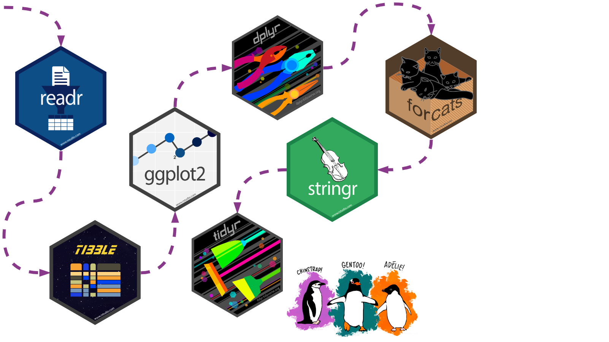{.absolute top=30 left=30 width="100%" fig-alt="Our illustrated penguins have reached the tidyr package! The photo backdrop is a snowy Antarctic wonderland featuring a Gentoo penguin with outstretched flippers"}

::: footer
<span>Photo by <a href="https://unsplash.com/@eadesstudio?utm_source=unsplash&amp;utm_medium=referral&amp;utm_content=creditCopyText">James Eades</a> on <a href="https://unsplash.com/collections/12240655/palmerpenguins/d5aed8c855e26061e5e651d3f180b76d?utm_source=unsplash&amp;utm_medium=referral&amp;utm_content=creditCopyText">Unsplash</a></span>
:::

---

## tidyr: info {background-image="images/hex/tidyr.png" background-size="8%" background-position="98% 4%"}

<!--start panels-->
::: {.panel-tabset}

### Overview {.center}

`tidyr` helps us transform our dataset into a [tidy format](https://r4ds.had.co.nz/tidy-data.html)

> There are three interrelated rules which make a dataset tidy:
>
> - Each variable must have its own column.
> - Each observation must have its own row.
> - Each value must have its own cell.
> {fig-alt="schematic representing the 3 earlier points"}

### Cheatsheet

 PDF: <https://github.com/rstudio/cheatsheets/blob/main/tidyr.pdf>
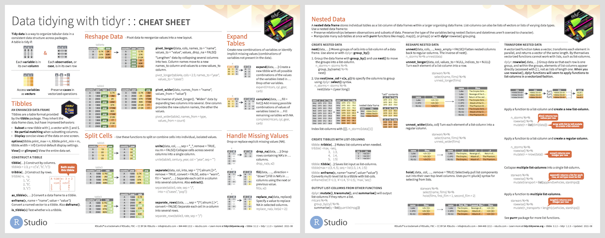{fig-alt="tidyr cheatsheet"}

### Reading

<!--start columns-->
:::: {.columns}

::: {.column width="40%"}

{width="300" fig-alt="R4DS book cover"}

:::

::: {.column width="60%"}

<br><br>

#### R for Data Science: [Ch 12 Tidy data](https://r4ds.had.co.nz/tidy-data.html)

#### Package documentation: <https://tidyr.tidyverse.org>

:::

::::
<!--end columns-->

::: 
<!--end panels-->

## tidyr: exercise {background-image="images/hex/tidyr.png" background-size="8%" background-position="98% 4%"}

<!--start panels-->
::: {.panel-tabset}

### Un-tidying

#### Both penguin datasets are already tidy!

We can pretend that `penguins` wasn't tidy and that it looked instead like `untidy_penguins` below, where **body_mass_g** was recorded separately for *male*, *female*, and *NA* **sex** penguins.

::: {.cell}

```{.r .cell-code}
untidy_penguins <- penguins |> pivot_wider(names_from = sex, values_from = body_mass_g)
untidy_penguins
```

::: {.cell-output .cell-output-stdout}
```
# A tibble: 344 × 9
   species island    bill_length_mm bill_dept…¹ flipp…²  year  male female  `NA`
   <fct>   <fct>              <dbl>       <dbl>   <int> <int> <int>  <int> <int>
 1 Adelie  Torgersen           39.1        18.7     181  2007  3750     NA    NA
 2 Adelie  Torgersen           39.5        17.4     186  2007    NA   3800    NA
 3 Adelie  Torgersen           40.3        18       195  2007    NA   3250    NA
 4 Adelie  Torgersen           NA          NA        NA  2007    NA     NA    NA
 5 Adelie  Torgersen           36.7        19.3     193  2007    NA   3450    NA
 6 Adelie  Torgersen           39.3        20.6     190  2007  3650     NA    NA
 7 Adelie  Torgersen           38.9        17.8     181  2007    NA   3625    NA
 8 Adelie  Torgersen           39.2        19.6     195  2007  4675     NA    NA
 9 Adelie  Torgersen           34.1        18.1     193  2007    NA     NA  3475
10 Adelie  Torgersen           42          20.2     190  2007    NA     NA  4250
# … with 334 more rows, and abbreviated variable names ¹​bill_depth_mm,
#   ²​flipper_length_mm
```
:::
:::

### Re-tidying

#### Now let's make it tidy again!

We'll use the help of `pivot_longer()`

::: {.cell}

```{.r .cell-code  code-line-numbers="2,3,4"}
untidy_penguins |>
  pivot_longer(cols = male:`NA`,           
               names_to = "sex",           
               values_to = "body_mass_g")
```

::: {.cell-output .cell-output-stdout}
```
# A tibble: 1,032 × 8
   species island    bill_length_mm bill_depth_mm flipper_…¹  year sex   body_…²
   <fct>   <fct>              <dbl>         <dbl>      <int> <int> <chr>   <int>
 1 Adelie  Torgersen           39.1          18.7        181  2007 male     3750
 2 Adelie  Torgersen           39.1          18.7        181  2007 fema…      NA
 3 Adelie  Torgersen           39.1          18.7        181  2007 NA         NA
 4 Adelie  Torgersen           39.5          17.4        186  2007 male       NA
 5 Adelie  Torgersen           39.5          17.4        186  2007 fema…    3800
 6 Adelie  Torgersen           39.5          17.4        186  2007 NA         NA
 7 Adelie  Torgersen           40.3          18          195  2007 male       NA
 8 Adelie  Torgersen           40.3          18          195  2007 fema…    3250
 9 Adelie  Torgersen           40.3          18          195  2007 NA         NA
10 Adelie  Torgersen           NA            NA           NA  2007 male       NA
# … with 1,022 more rows, and abbreviated variable names ¹​flipper_length_mm,
#   ²​body_mass_g
```
:::
:::

:::
<!--end panels-->


# 08-purrr {visibility="hidden"}


## {background-image="https://images.unsplash.com/photo-1591792111137-5b8219d5fad6?ixlib=rb-1.2.1&ixid=eyJhcHBfaWQiOjEyMDd9&auto=format&fit=crop&w=4350&q=80" background-position="52% 5%" background-size="cover"}

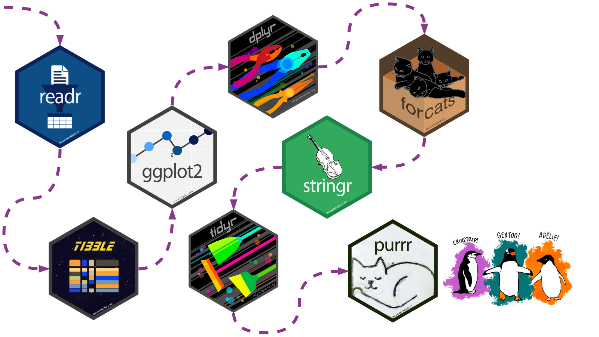{.absolute top=30 left=30 width="100%" fig-alt="Our illustrated penguins have reached the purrr package! The photo backdrop is a snowy Antarctic wonderland featuring a Gentoo penguin with outstretched flippers"}

::: footer
<span>Photo by <a href="https://unsplash.com/@eadesstudio?utm_source=unsplash&amp;utm_medium=referral&amp;utm_content=creditCopyText">James Eades</a> on <a href="https://unsplash.com/collections/12240655/palmerpenguins/d5aed8c855e26061e5e651d3f180b76d?utm_source=unsplash&amp;utm_medium=referral&amp;utm_content=creditCopyText">Unsplash</a></span>
:::

---

## purrr: info {background-image="images/hex/purrr.png" background-size="8%" background-position="98% 4%"}

<!--start panels-->
::: {.panel-tabset}

### Overview {.center}

<br><br>

:::: {.columns}

::: {.column width=48%}

#### Provides tools for working with functions and vectors 

The `purrr` family of functions helps us replace for loops, making our code easier to read and more succint.

:::

::: {.column width=50%}

#### With `purrr` you can

- Iterate over a single input with `map()`
- Iterate over two inputs in parallel with `map2()`
- Iterate with multiple arguments with `pmap()`
- Iterate with multiple arguments and functions with `invoke_map()`
- Call a function for its side-effects with `walk()`, `walk2()`, and `pwalk()`

:::

::::
<!--end columns-->

### Cheatsheet

 PDF: <https://github.com/rstudio/cheatsheets/raw/main/purrr.pdf>
{fig-alt="purrr cheatsheet"}

### Reading

<!--start columns-->
:::: {.columns}

::: {.column width="40%"}

{width="300"}{fig-alt="R4DS book cover"}

:::

::: {.column width="60%"}

<br><br>

#### R for Data Science: [Ch 21 Iteration](https://r4ds.had.co.nz/iteration.html)

#### Package documentation: <https://purrr.tidyverse.org>

:::

::::
<!--end columns-->

::: 
<!--end panels-->

## purrr: exercise {background-image="images/hex/purrr.png" background-size="8%" background-position="98% 4%"}

<!--start panels-->
::: {.panel-tabset}

### Time for a change?

:::: {.columns}

::: {.column width=30%}

Ok, we love our earlier boxplot showing us **body_mass_g** by **sex** and colored by **species**... 

...but let's change up the colors to keep with our Antarctica theme!

I'm a big fan of the color palettes in the `nord` 📦

:::

::: {.column width=5%}

:::

::: {.column width=65%}

{fig-alt="16 different nordic color palettes from the Nord package. We will be focusing on the mountain_forms palette which was dark teal, dusty blue, snowy white, dusty purple, and dark purple"}

:::

::::
<!--end columns-->

### Goal

:::: {.columns}

::: {.column}

Let's turn this plot...

::: {.cell}
::: {.cell-output-display}
{fig-alt='Our filled boxplot from our earlier ggplot2 exercises! To recap, a boxplot with penguin sex along the x axis and body mass along the y axis. Again, the three sex categories are female, male, and NA, and the body mass appears to range between 2400g and 6500g. There is a boxplot for each species per sex category, and these are filled with different colors. Gentoo boxplots are blue, Adélie boxplots are reddish, and Chinstrap boxplots are green.' width=960}
:::
:::

:::

::: {.column}

...into this one!

::: {.cell}
::: {.cell-output-display}
{fig-alt='In contrast to the other filled boxplot referred to in this tab, this one is filled with nordic colors. Gentoo boxplots are a dark purple, Adélie boxplots are a dark teal, and Chinstrap boxplots are a snowy white.' width=960}
:::
:::

::: {.small-text}
Note: The color choices in this example are meant for demo purposes only. Be sure to consider the [accessibility of your data viz](https://www.highcharts.com/blog/tutorials/10-guidelines-for-dataviz-accessibility), including color contrast between different elements.
:::

:::

::::
<!--end columns-->

### Option 1

:::: {.columns}

::: {.column}

You can choose colors using<br>the color hex codes

::: {.cell}

```{.r .cell-code}
nord::nord_palettes$mountain_forms
```

::: {.cell-output .cell-output-stdout}
```
[1] "#184860" "#486078" "#d8d8d8" "#484860" "#181830"
```
:::
:::

And assign them using the `scale_fill_manual()` function

::: {.cell}

```{.r .cell-code  code-line-numbers="4-7"}
penguins |>
  ggplot(aes(x = sex, y = body_mass_g)) +
  geom_boxplot(aes(fill = species)) +
  scale_fill_manual(
    values = c("#184860", 
               "#D8D8D8", 
               "#181830"))
```
:::

:::

::: {.column}

<br>

::: {.cell}
::: {.cell-output-display}
{width=960}
:::
:::

:::

:::: 
<!--end columns-->

### Options 2 & 3

:::: {.columns}

::: {.column}

You can also use the palette name, like **mountain_forms**, though the colors assigned may not align with what you want
<br>

::: {.cell}

```{.r .cell-code  code-line-numbers="4-6"}
penguins |>
  ggplot(aes(x = sex, y = body_mass_g)) +
  geom_boxplot(aes(fill = species)) +
  scale_fill_manual(
    values = nord::nord_palettes$mountain_forms
    )
```

::: {.cell-output-display}
{fig-alt='Our boxplot filled with nordic colors though the scale_fill_manual function has automatically selected a different combination of colors from the palette. Gentoo boxplots are snowy white intead of dark purple, Adélie boxplots are a still a dark teal, and Chinstrap boxplots are a dusty blue intead of snowy white.' width=480}
:::
:::

:::

::: {.column}

And sometimes, color palette packages come with their own functions that assign colors, like `scale_fill_nord()`

::: {.cell}

```{.r .cell-code  code-line-numbers="4-6"}
penguins |>
  ggplot(aes(x = sex, y = body_mass_g)) +
  geom_boxplot(aes(fill = species)) +
  nord::scale_fill_nord(
    palette = "mountain_forms"
    )
```

::: {.cell-output-display}
{fig-alt='Our boxplot filled with nordic colors. Gentoo boxplots are a dark purple, Adélie boxplots are a dark teal, and Chinstrap boxplots are a snowy white.' width=480}
:::
:::

:::

::::
<!--end columns-->

### Purrr?

:::: {.columns}

::: {.column}

The `prismatic` 📦 helps us **see** the colors that correspond to each color hex code (mostly), with the `color()` function


::: {.cell}

```{.r .cell-code}
library(prismatic)

prismatic::color(
    nord::nord_palettes$mountain_forms
    )
```
:::
{fig-alt="hex codes for the 5 colors in the mountain_forms palette, with a background color to match it. Dark teal is #184860, dusty blue is #486078, snowy white is #D8D8D8, purple is #484860, and dark purple is #181830"}

:::

::: {.column}

`purrr`'s `map()` function can help us iterate `color()` over all palettes in a palette package like `nord`!

::: {.cell}

```{.r .cell-code}
nord::nord_palettes |> 
    map(prismatic::color)
```
:::

{fig-alt="hex color codes for 4 of the palettes in the nord package, including mountain_forms"}

:::

::::
<!--end columns-->

### More palettes!

:::: {.columns}

::: {.column}

<br><br>

🎨 [r-color-palettes repo](https://github.com/EmilHvitfeldt/r-color-palettes) from Emil Hvitfeldt

Like this Wes Anderson themed one! And many, many others 🤩

:::

::: {.column}

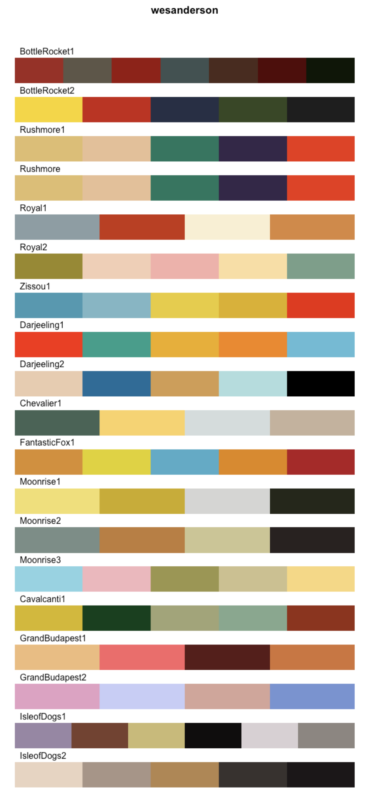{fig-alt="10 different bright color palettes from the wesanderson color palette package."}

:::

::::
<!--end columns-->

:::
<!--end panels-->


# 09-lubridate {visibility="hidden"}


## {background-image="https://images.unsplash.com/photo-1591792111137-5b8219d5fad6?ixlib=rb-1.2.1&ixid=eyJhcHBfaWQiOjEyMDd9&auto=format&fit=crop&w=4350&q=80" background-position="52% 5%" background-size="cover"}

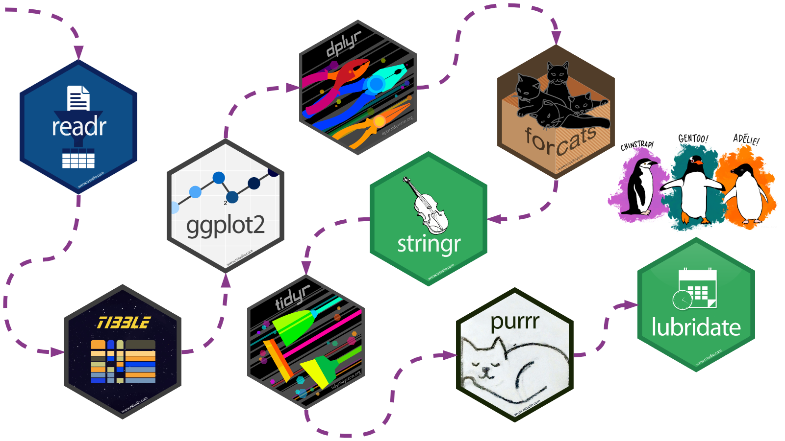{.absolute top=50 left=50 width="100%" fig-alt="Our illustrated penguins are ending their tour with the lubridate package! The photo backdrop is a snowy Antarctic wonderland featuring a Gentoo penguin with outstretched flippers"}


::: footer
<span>Photo by <a href="https://unsplash.com/@eadesstudio?utm_source=unsplash&amp;utm_medium=referral&amp;utm_content=creditCopyText">James Eades</a> on <a href="https://unsplash.com/collections/12240655/palmerpenguins/d5aed8c855e26061e5e651d3f180b76d?utm_source=unsplash&amp;utm_medium=referral&amp;utm_content=creditCopyText">Unsplash</a></span>
:::

---

## lubridate: info {background-image="images/hex/lubridate.png" background-size="8%" background-position="98% 4%"}

<!--start panels-->
::: {.panel-tabset}

### Overview

<br><br>

<!--start columns-->
:::: {.columns}

::: {.column width="50%"}

### `lubridate` helps us work with dates and times, including 

- a **date** like `August 31, 2022`
- a **time** like `10:35 am`
- a **date-time** like `2022-08-31 10:35:00`

:::

::: {.column width="50%"}
### You can...

- convert strings or numbers to date-times
- get and set components of a date-time
- round date-times
- add or subtract periods to model events that happen at specific clock times
- add or substract durations to model a physical process
- work with time intervals

:::

::::
<!--end columns-->

### Cheatsheet

 PDF: <https://github.com/rstudio/cheatsheets/blob/main/lubridate.pdf>
{fig-alt="lubridate cheatsheet"}

### Reading

<!--start columns-->
:::: {.columns}

::: {.column width="40%"}

{width="300" fig-alt="R4DS book cover"}

:::

::: {.column width="60%"}

<br>

### R for Data Science: [Ch 16 Dates and times](https://r4ds.had.co.nz/dates-and-times.html)

### Package documentation: <https://lubridate.tidyverse.org>

:::

::::
<!--end columns-->

::: 
<!--end panels-->

## lubridate: exercise {background-image="images/hex/lubridate.png" background-size="8%" background-position="98% 4%"}

<!--start panels-->
::: {.panel-tabset}

### Read data in

Recall that `palmperpenguins` includes raw data as well

::: {.cell}

```{.r .cell-code}
penguins_raw <- palmerpenguins::penguins_raw
penguins_raw
```

::: {.cell-output .cell-output-stdout}
```
# A tibble: 344 × 17
   studyName Sample Num…¹ Species Region Island Stage Indiv…² Clutc…³ `Date Egg`
   <chr>            <dbl> <chr>   <chr>  <chr>  <chr> <chr>   <chr>   <date>    
 1 PAL0708              1 Adelie… Anvers Torge… Adul… N1A1    Yes     2007-11-11
 2 PAL0708              2 Adelie… Anvers Torge… Adul… N1A2    Yes     2007-11-11
 3 PAL0708              3 Adelie… Anvers Torge… Adul… N2A1    Yes     2007-11-16
 4 PAL0708              4 Adelie… Anvers Torge… Adul… N2A2    Yes     2007-11-16
 5 PAL0708              5 Adelie… Anvers Torge… Adul… N3A1    Yes     2007-11-16
 6 PAL0708              6 Adelie… Anvers Torge… Adul… N3A2    Yes     2007-11-16
 7 PAL0708              7 Adelie… Anvers Torge… Adul… N4A1    No      2007-11-15
 8 PAL0708              8 Adelie… Anvers Torge… Adul… N4A2    No      2007-11-15
 9 PAL0708              9 Adelie… Anvers Torge… Adul… N5A1    Yes     2007-11-09
10 PAL0708             10 Adelie… Anvers Torge… Adul… N5A2    Yes     2007-11-09
# … with 334 more rows, 8 more variables: `Culmen Length (mm)` <dbl>,
#   `Culmen Depth (mm)` <dbl>, `Flipper Length (mm)` <dbl>,
#   `Body Mass (g)` <dbl>, Sex <chr>, `Delta 15 N (o/oo)` <dbl>,
#   `Delta 13 C (o/oo)` <dbl>, Comments <chr>, and abbreviated variable names
#   ¹​`Sample Number`, ²​`Individual ID`, ³​`Clutch Completion`
```
:::
:::

### View date-times

In the raw data, `Date Egg` is the date that a penguin nest in the study was observed with 1 egg

Check out `?penguins_raw` to learn more about the other variables in this dataset

::: {.cell}

```{.r .cell-code}
penguins_raw |> select(Species, Sex, `Date Egg`)
```

::: {.cell-output .cell-output-stdout}
```
# A tibble: 344 × 3
   Species                             Sex    `Date Egg`
   <chr>                               <chr>  <date>    
 1 Adelie Penguin (Pygoscelis adeliae) MALE   2007-11-11
 2 Adelie Penguin (Pygoscelis adeliae) FEMALE 2007-11-11
 3 Adelie Penguin (Pygoscelis adeliae) FEMALE 2007-11-16
 4 Adelie Penguin (Pygoscelis adeliae) <NA>   2007-11-16
 5 Adelie Penguin (Pygoscelis adeliae) FEMALE 2007-11-16
 6 Adelie Penguin (Pygoscelis adeliae) MALE   2007-11-16
 7 Adelie Penguin (Pygoscelis adeliae) FEMALE 2007-11-15
 8 Adelie Penguin (Pygoscelis adeliae) MALE   2007-11-15
 9 Adelie Penguin (Pygoscelis adeliae) <NA>   2007-11-09
10 Adelie Penguin (Pygoscelis adeliae) <NA>   2007-11-09
# … with 334 more rows
```
:::
:::

### Get date components

We can use `year()`, `month()`, and `day()` to extract different components from `Date Egg`

In addition, `month()` provides some options to let us decide whether we want the month displayed as a character string, and whether we want that string abbreviated

::: {.cell}

```{.r .cell-code  code-line-numbers="3-5"}
penguins_raw |> 
  select(Species, Sex, `Date Egg`) |> 
  mutate(Year = year(`Date Egg`),
         Month = month(`Date Egg`, label = TRUE, abbr = FALSE),
         Day = day(`Date Egg`))
```

::: {.cell-output .cell-output-stdout}
```
# A tibble: 344 × 6
   Species                             Sex    `Date Egg`  Year Month      Day
   <chr>                               <chr>  <date>     <dbl> <ord>    <int>
 1 Adelie Penguin (Pygoscelis adeliae) MALE   2007-11-11  2007 November    11
 2 Adelie Penguin (Pygoscelis adeliae) FEMALE 2007-11-11  2007 November    11
 3 Adelie Penguin (Pygoscelis adeliae) FEMALE 2007-11-16  2007 November    16
 4 Adelie Penguin (Pygoscelis adeliae) <NA>   2007-11-16  2007 November    16
 5 Adelie Penguin (Pygoscelis adeliae) FEMALE 2007-11-16  2007 November    16
 6 Adelie Penguin (Pygoscelis adeliae) MALE   2007-11-16  2007 November    16
 7 Adelie Penguin (Pygoscelis adeliae) FEMALE 2007-11-15  2007 November    15
 8 Adelie Penguin (Pygoscelis adeliae) MALE   2007-11-15  2007 November    15
 9 Adelie Penguin (Pygoscelis adeliae) <NA>   2007-11-09  2007 November     9
10 Adelie Penguin (Pygoscelis adeliae) <NA>   2007-11-09  2007 November     9
# … with 334 more rows
```
:::
:::

:::
<!--end panels-->


## Thanks for following along! {.center background-image="https://images.unsplash.com/photo-1505168125601-4ddfdea4c7e7?ixlib=rb-1.2.1&ixid=eyJhcHBfaWQiOjEyMDd9&auto=format&fit=crop&w=2102&q=80" background-size="cover"}

### [`<svg aria-label="Link" role="img" viewBox="0 0 640 512" style="height:1em;width:1.25em;vertical-align:-0.125em;margin-left:auto;margin-right:auto;font-size:inherit;fill:currentColor;overflow:visible;position:relative;"><title>Link</title><path d="M172.5 131.1C228.1 75.51 320.5 75.51 376.1 131.1C426.1 181.1 433.5 260.8 392.4 318.3L391.3 319.9C381 334.2 361 337.6 346.7 327.3C332.3 317 328.9 297 339.2 282.7L340.3 281.1C363.2 249 359.6 205.1 331.7 177.2C300.3 145.8 249.2 145.8 217.7 177.2L105.5 289.5C73.99 320.1 73.99 372 105.5 403.5C133.3 431.4 177.3 435 209.3 412.1L210.9 410.1C225.3 400.7 245.3 404 255.5 418.4C265.8 432.8 262.5 452.8 248.1 463.1L246.5 464.2C188.1 505.3 110.2 498.7 60.21 448.8C3.741 392.3 3.741 300.7 60.21 244.3L172.5 131.1zM467.5 380C411 436.5 319.5 436.5 263 380C213 330 206.5 251.2 247.6 193.7L248.7 192.1C258.1 177.8 278.1 174.4 293.3 184.7C307.7 194.1 311.1 214.1 300.8 229.3L299.7 230.9C276.8 262.1 280.4 306.9 308.3 334.8C339.7 366.2 390.8 366.2 422.3 334.8L534.5 222.5C566 191 566 139.1 534.5 108.5C506.7 80.63 462.7 76.99 430.7 99.9L429.1 101C414.7 111.3 394.7 107.1 384.5 93.58C374.2 79.2 377.5 59.21 391.9 48.94L393.5 47.82C451 6.731 529.8 13.25 579.8 63.24C636.3 119.7 636.3 211.3 579.8 267.7L467.5 380z"/></svg>`{=html} silviacanelon.com](https://www.silviacanelon.com)<br/>
### [`<svg aria-label="Twitter" role="img" viewBox="0 0 512 512" style="height:1em;width:1em;vertical-align:-0.125em;margin-left:auto;margin-right:auto;font-size:inherit;fill:currentColor;overflow:visible;position:relative;"><title>Twitter</title><path d="M459.4 151.7c.325 4.548 .325 9.097 .325 13.65 0 138.7-105.6 298.6-298.6 298.6-59.45 0-114.7-17.22-161.1-47.11 8.447 .974 16.57 1.299 25.34 1.299 49.06 0 94.21-16.57 130.3-44.83-46.13-.975-84.79-31.19-98.11-72.77 6.498 .974 12.99 1.624 19.82 1.624 9.421 0 18.84-1.3 27.61-3.573-48.08-9.747-84.14-51.98-84.14-102.1v-1.299c13.97 7.797 30.21 12.67 47.43 13.32-28.26-18.84-46.78-51.01-46.78-87.39 0-19.49 5.197-37.36 14.29-52.95 51.65 63.67 129.3 105.3 216.4 109.8-1.624-7.797-2.599-15.92-2.599-24.04 0-57.83 46.78-104.9 104.9-104.9 30.21 0 57.5 12.67 76.67 33.14 23.72-4.548 46.46-13.32 66.6-25.34-7.798 24.37-24.37 44.83-46.13 57.83 21.12-2.273 41.58-8.122 60.43-16.24-14.29 20.79-32.16 39.31-52.63 54.25z"/></svg>`{=html} @spcanelon](https://twitter.com/spcanelon)<br/>
### [`<svg aria-label="GitHub" role="img" viewBox="0 0 496 512" style="height:1em;width:0.97em;vertical-align:-0.125em;margin-left:auto;margin-right:auto;font-size:inherit;fill:currentColor;overflow:visible;position:relative;"><title>GitHub</title><path d="M165.9 397.4c0 2-2.3 3.6-5.2 3.6-3.3 .3-5.6-1.3-5.6-3.6 0-2 2.3-3.6 5.2-3.6 3-.3 5.6 1.3 5.6 3.6zm-31.1-4.5c-.7 2 1.3 4.3 4.3 4.9 2.6 1 5.6 0 6.2-2s-1.3-4.3-4.3-5.2c-2.6-.7-5.5 .3-6.2 2.3zm44.2-1.7c-2.9 .7-4.9 2.6-4.6 4.9 .3 2 2.9 3.3 5.9 2.6 2.9-.7 4.9-2.6 4.6-4.6-.3-1.9-3-3.2-5.9-2.9zM244.8 8C106.1 8 0 113.3 0 252c0 110.9 69.8 205.8 169.5 239.2 12.8 2.3 17.3-5.6 17.3-12.1 0-6.2-.3-40.4-.3-61.4 0 0-70 15-84.7-29.8 0 0-11.4-29.1-27.8-36.6 0 0-22.9-15.7 1.6-15.4 0 0 24.9 2 38.6 25.8 21.9 38.6 58.6 27.5 72.9 20.9 2.3-16 8.8-27.1 16-33.7-55.9-6.2-112.3-14.3-112.3-110.5 0-27.5 7.6-41.3 23.6-58.9-2.6-6.5-11.1-33.3 2.6-67.9 20.9-6.5 69 27 69 27 20-5.6 41.5-8.5 62.8-8.5s42.8 2.9 62.8 8.5c0 0 48.1-33.6 69-27 13.7 34.7 5.2 61.4 2.6 67.9 16 17.7 25.8 31.5 25.8 58.9 0 96.5-58.9 104.2-114.8 110.5 9.2 7.9 17 22.9 17 46.4 0 33.7-.3 75.4-.3 83.6 0 6.5 4.6 14.4 17.3 12.1C428.2 457.8 496 362.9 496 252 496 113.3 383.5 8 244.8 8zM97.2 352.9c-1.3 1-1 3.3 .7 5.2 1.6 1.6 3.9 2.3 5.2 1 1.3-1 1-3.3-.7-5.2-1.6-1.6-3.9-2.3-5.2-1zm-10.8-8.1c-.7 1.3 .3 2.9 2.3 3.9 1.6 1 3.6 .7 4.3-.7 .7-1.3-.3-2.9-2.3-3.9-2-.6-3.6-.3-4.3 .7zm32.4 35.6c-1.6 1.3-1 4.3 1.3 6.2 2.3 2.3 5.2 2.6 6.5 1 1.3-1.3 .7-4.3-1.3-6.2-2.2-2.3-5.2-2.6-6.5-1zm-11.4-14.7c-1.6 1-1.6 3.6 0 5.9 1.6 2.3 4.3 3.3 5.6 2.3 1.6-1.3 1.6-3.9 0-6.2-1.4-2.3-4-3.3-5.6-2z"/></svg>`{=html} @spcanelon](https://github.com/spcanelon) 

